**Documentation**
Documentation is vital and must be done throughout the project, not the end.<br>
This includes examples for the use of each function.<br>

*Non-unity users*

<h1>Python</h1>
* Sphinx
* Numpydocs formatting
* Must comply with doctest
* Must include examples

<h1>C++</h1>
* Doxygen
* Must have a getting started page for each module
* links to C# and Python interfaces for each function, module

<h1>Unity users</h1>
* Doxygen

There are three users of the codebase.
- People that will develop the foundation of the code (includes people like you).
- People that will use the interfaces and our codebase as an API.
- People that will use final products that are built with the codebase.

Each user group must be considered at each stage.

Coding standards are important, sometimes there is the ‘industry standard’ way.<br>
This is not always in alignment with the needs of the project or with research.<br>
It’s likely some things will be different, it should always be discussed and clarified.<br>
It should also be in the documentation.

<h1>Python</h1>
* pep8 convention in most cases (ask otherwise)
* Do not make everything a class. A class should only be used when it is very clearly necessary. Algorithms should be done in a functional way.
* Do not add dependencies without making an issue on why you need it (this goes for libraries that are not already listed as dependencies for the code)

<h1>C#</h1>
* Naming Conventions and Coding Standards have to be well followed (https://sites.google.com/site/wcfpandu/student-of-the-month/c-coding-standards-and-naming-conventions)
* Code general architecture should be discussed and well maintained.

<h1>Doxygen Guidelines</h1>
<b>Overview</b><br>
* Methods and xml format to use in methods
* Algorithms should be documented inline with source rather than headers
* Interface details should remain with headers

<b>Table of contents</b><br>
- Using TODO
- Documenting the heads of each file
- Documenting member fields
- Snippets and Code Samples
- Adding images for headers/sources, and markdown files (<code>.md</code>)
- Why the use of <code>///</code> and <code>//</code>?

<h2>Using <code>TODO</code></h2>
To have a TODO automatically pull to documentation use:<br>
<code>/// TODO:</code>

<h2>Documenting the heads of each file (headers and sources)</h2>

<b>The head of each file should contain the following tags:</b><br>

<code>\file</code><br>
Name of a file<br>
e.g. <b><code>/// \file     node.h</code></b><br>
https://www.doxygen.nl/manual/commands.html#cmdfile

<code>\brief</code><br>
A one-line description describing the contents of the file<br>
e.g. <b><code>/// \brief    Header file for a node data structure, used in a graph ADT</code></b><br>
https://www.doxygen.nl/manual/commands.html#cmdbrief

<code>\author</code><br>
The author of the file<br>
If there are multiple authors,<br>
you may use one <code>\author</code> tag for all of the authors,<br>
or one <code>\author</code> tag per person/entity.<br>
e.g. <b><code>/// \author   John Doe</code></b><br>
https://www.doxygen.nl/manual/commands.html#cmdauthor

<code>\date</code><br>
This may be the date of the file's last update,<br>
or the date the file was created -- whichever is relevant.<br>
e.g. <b><code>/// \date   06 Jun 2020</code></b><br>
https://www.doxygen.nl/manual/commands.html#cmddate

An example of a file head would look like this:

<code>///
/// \file       node.h
/// \brief      Header file for a node data structure, used in a graph ADT
///
/// \author     John Doe
/// \date       06 Jun 2020
///</code>

Other notes:<b>
- Follow each <code>///</code> with a <b>single</b> space, before using a tag.
- Follow each tag with <b>two</b> tabs, then provide the description.

<h2>Documenting member fields</h2>

Here is a simple example:<br>
<code>struct position {
    float x, y, z;  ///< Cartesian coordinates x, y, and z
    int id;         ///< Unique identifier
};</code>

The general format is <code>///< Description goes here</code>,<br>
notice that a <b>single whitespace character</b> follows <code>///<</code><br>
and the field descriptions are in alignment with each other, using tabs.<br>
Sometimes, this is not always possible,<br>
but do your best to keep the formatting <b>neat</b> and <b>consistent</b>.

<h2>Snippets and code samples</h2>

<h3>The <code>\snippet</code> tag should be used for long examples that are over 10 lines.</h3>
https://www.doxygen.nl/manual/commands.html#cmdsnippet

<b>Step 0:</b><br>
In a header file, at the line where you want the snippet to appear:

<code>/// \snippet PATH_TO_FILE\filename.cpp SnippetName</code>

If you would like to include line numbers for the snippet, you may use the tag
<code>\snippet{lineno}</code>
This is best used for directly referencing source files from within this repo,
since the line numbers that appear are the actual line numbers of the code used
for the snippet.

<b>Step 1:</b><br>
In <code>PATH_TO_FILE\filename.cpp</code> (where the snippet sample is),

<code>/// [SnippetName]
std::cout << "My sample snippet" << std::endl;
/// [SnippetName]
</code>

Notice that the code is not a comment.

<b>Step 2:</b><br>
The following steps utilize the Doxygen GUI Frontend.

Load the Doxyfile from this repo into Doxygen, using the File menu.
The Doxyfile is in <code>Analysis\src\Doxyfile</code>

<b>Step 3:</b><br>
- Navigate to the Expert tab on the left hand side.
- Under topics, click 'Input'.
- On the right side, scroll down until you see EXAMPLE_PATH.
- In the EXAMPLE_PATH section, click the folder button to reveal a file prompt.
- Within the file prompt, select the file path where the snippet resides. (<code>PATH_TO_FILE\filename.cpp</code>)
- Add any more directories/paths where your snippets will come from.

Snippets will now appear when you navigate to the Run tab, and click 'Run Doxygen'.

<h3>The <code>\code</code> tag should be used for code block examples under 10 lines.</h3>
https://www.doxygen.nl/manual/commands.html#cmdcode

To use the <code>\code</code> tag:

<b>Step 0:</b><br>
In a header file, at the line where you want the code sample to appear,
start with the <code>\code{.cpp}</code> tag.

<code>/// \code{.cpp}</code>

<b>Step 1:</b><br>
Create the section where the code sample will appear.
We will be using the <code>///</code> comment style.

<code>/// std::cout << "Your sample code goes here." << std::endl;
/// std::cout << "Notice the whitespace after the '///'. << std::endl;
/// // Use '//' for comments within the sample.</code><br>

To be clear:
- <b>All</b> lines in the sample must begin with <code>///</code>, followed by a whitespace
- Any comments that occur within the sample must begin with <code>//</code>, followed by a whitespace.

Our convention dictates that a single character of whitespace ('<code> </code>')
<br> <b>must</b> follow a <code>///</code> or <code>//</code>, whenever:
- a <code>\code</code> tag is initiated
- a sample line of code begins
- a comment begins within the sample code
- a <code>\endcode</code> tag is used to end a sample

<br>This ensures ease of viewing<br>
for anyone reading the source code -- <br>
and also assists Doxygen with the<br>
formatting process for the HTML export.<br>

For more information, see<br>
'Why the use of <code>///</code> and <code>//</code>?'<br>
at the bottom of this page.<br>

<b>Step 2:</b><br>
End your code sample with the tag <code>\endcode</code>

<code>/// \endcode</code>

A properly-formatted sample will look like this:

<code>/// \code{.cpp}
/// std::cout << "Your sample code goes here." << std::endl;
/// std::cout << "Notice the whitespace after the '///'. << std::endl;
/// // Use '//' for comments within the sample.
/// \endcode</code><br>

In the final HTML, your sample would look like this:

<code>std::cout << "Your sample code goes here." << std::endl;
std::cout << "Notice the whitespace after the '///'. << std::endl;
// Use '//' for comments within the sample.</code>

You may now use <b>'Run Doxygen'</b> to export your documentation.
(There are no extra steps, unlike with the snippet section)

<h2>Adding images for headers/sources, and markdown files (<code>.md</code>)</h2>

For <b>headers/sources</b>,<br>
we will be using the <code>\image</code> tag to add images.<br>
https://www.doxygen.nl/manual/commands.html#cmdimage

For <b>markdown files (<code>.md</code>)</b>,<br>
we will be using the markdown syntax for images.<br>
https://guides.github.com/features/mastering-markdown/

In <b>Analysis</b>,<br>
we have a subdirectory named <b>docs</b>.<br>
(<code>Analysis\docs</code>)<br>

Doxygen will be configured to have it's <code>IMAGE_PATH</code><br>
configured such that its working directory for images begins at<br>
<code>Analysis\docs</code>. More on this at <b>step 3</b>.

<b>Step 0:</b><br>
Begin by saving copy of <b>image_file</b>,<br>
which is the filename of the desired image,<br>
into the following directory:<br>

```
Analysis\docs\language\img\enclosing_folder\module_name
```
<code><b>language</b></code>,<br>
<code><b>enclosing_folder</b></code>,<br>
and <code><b>module_name</b></code> are <b>placeholders</b>.<br>

<code>img</code> will be a subdirectory within <code><b>language</b></code>.

<b>Note:</b><br>
In the <b>Analysis\docs</b> directory,<br>
there are <b>three</b> subdirectories:<br>
for which the <code><b>language</b></code> placeholder applies:
- C# Documentation
- C++
- Python Docs

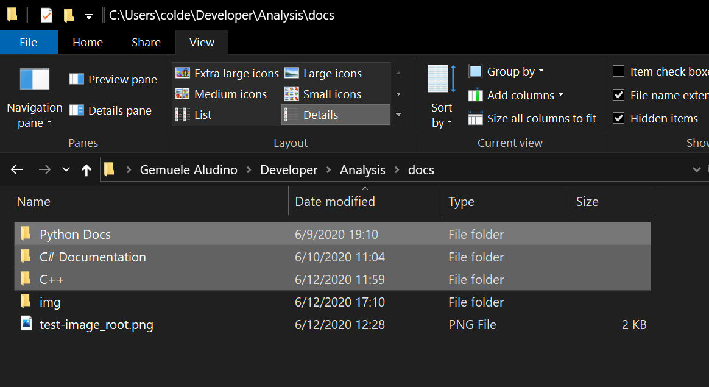
<b>The img subdirectory in docs is for images that don't belong with<br>
C# Documentation, C++, or Python Docs -- such as the images in <i>this</i> file.</b>

For <code><b>language</b></code>,<br>
<b>be sure to choose the appropriate subdirectory</b><br>
when saving your image file.

Although this particular example deals with inserting an image<br>
into documentation for a C++ header file,<br>
the same steps will apply for C# or Python sources.<br>

For instance, the full filepath of <code>node.h</code> is<br>
<code><b>Analysis\src\Cpp\spatialstructures\src\node.h</b></code>

<code><b>language</b></code> is <b>C++</b><br>
<code><b>enclosing_folder</b></code> is <b>spatialstructures</b><br>
<code><b>module_name</b></code> is <b>node</b><br>

So, if we wanted to insert an image for any documentation<br>
for <code>node.h</code> or <code>node.cpp</code>,<br>
the image would be saved into the following directory:<br>

<code><b>Analysis\docs\C++\img\spatialstructures\node</b></code>

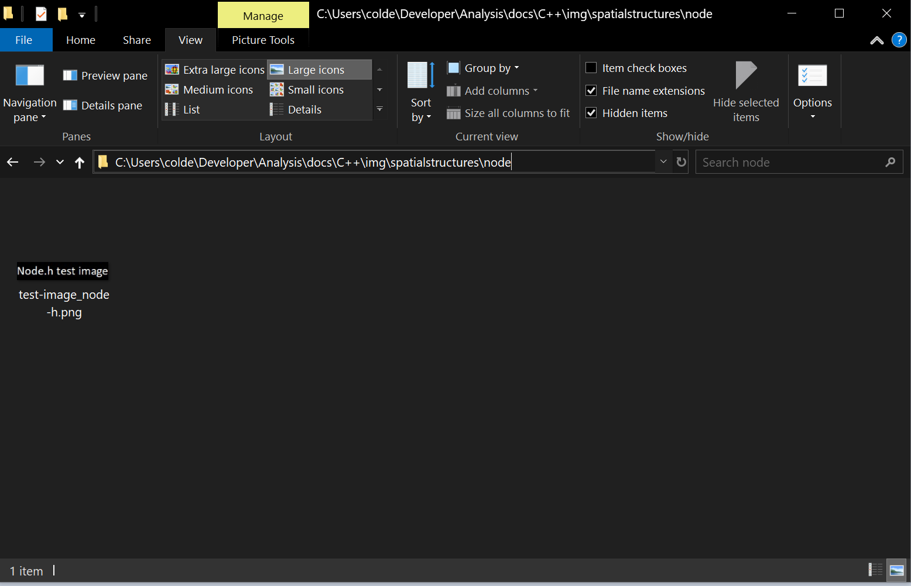

If directories <code><b>img</b></code>, <code><b>enclosing_folder</b></code>,<br> 
or <code><b>module_name</b></code><br>
do not already exist, you may create them.<br>

We can now proceed to editing the file where we want to insert the desired image.<br>
This could be a header/source file (step 1a), or a markdown file (step 1b).<br>

Scroll down to the instructions that apply to your use case.<br>

<h3>Adding an image to a header/source file</h3>

<b>Step 1a:</b><br>
In the header/source file where you want the image to appear,<br>
navigate to the line of code where you want the image to appear.<br>

We will now utilize the <code>\image</code> tag.

At the line where you want the image to appear,<br>
enter the following:

```
/// \image html language\img\enclosing_folder\module_name\image_file
```

Remember this example is using placeholders;<br>
be sure that <b>language</b>, <b>enclosing_folder</b>, <b>module_name</b>,<br>
and <b>image_file</b> correspond to where your image is saved.<br>

Also note that <b>img</b> is a subdirectory within your chosen <b>language</b> directory.<br>

An example use of the <code>\image</code> tag would be:<br>

<code>/// \image html C++\img\spatialstructures\node\test-image_node-h.png</code>

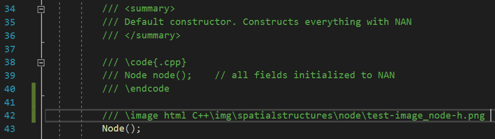
<b>See line 42 - example use of the <code>\image</code> tag.

We will now move on to the <b>Doxygen GUI frontend</b> application.

<h3>Adding an image to a markdown file (<code>.md</code>)</h3>

<b>Step 1b:</b><br>
In the markdown file where you want the image to appear,<br>
navigate to the line at which the image should be inserted.<br>

We will now utilize the markdown syntax for images.<br>

At the line where you want the image to appear,<br>
enter the following:

```

```
Remember this example is using placeholders;<br>
be sure that <b>language</b>, <b>enclosing_folder</b>, <b>module_name</b>,<br>
and <b>image_file</b> correspond to where your image is saved.<br>

An example use of the syntax would be:<br>

```

```
<code><b>language</b></code> is <b>C++</b><br>
<code><b>enclosing_folder</b></code> is <b>spatialstructures</b><br>
<code><b>module_name</b></code> is <b>node</b><br>
<code><b>image_file</b></code> is <b>test.png</b>


<b>This particular example is of mainpage.md, in Analysis\src\Cpp</b>

We will now move on to the <b>Doxygen GUI frontend (Doxywizard)</b> application.

<b>Step 2:</b><br>
Open Doxywizard.<br>


In <b>Doxygen GUI frontend (Doxywizard)</b> -- load the repository's Doxyfile.<br>

Click <b>File > Open...</b><br>


The 'Open configuration file' file explorer will appear.<br>
Navigate to your local copy of the Analysis repository,<br>
then click the <b>src</b> folder.<br>

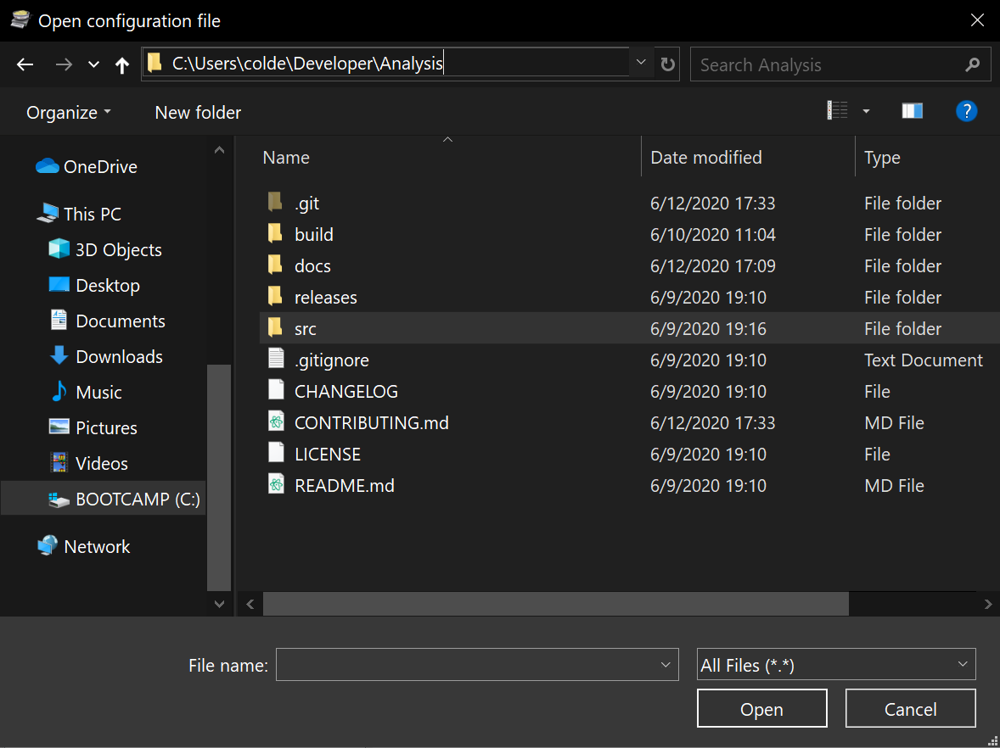
<b>Your path to the Analysis repository will differ, depending where it resides locally on your machine.</b>

Select the <b>Doxyfile</b> icon, and click <b>Open</b>.<br>

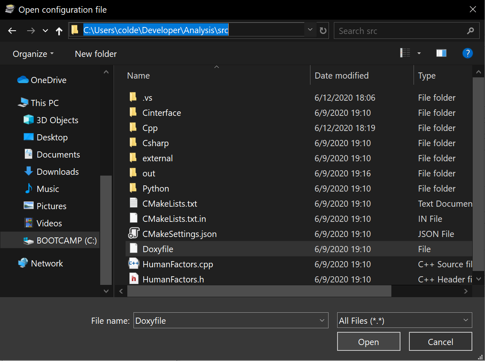
<b>You can also double-click the Doxyfile, instead of highlighting it and clicking 'Open'.</b>

Next,<br>
to the right of 'Step 1: Specify the working directory from which doxygen will run',<br>
click the <b>Select...</b> button.<br>

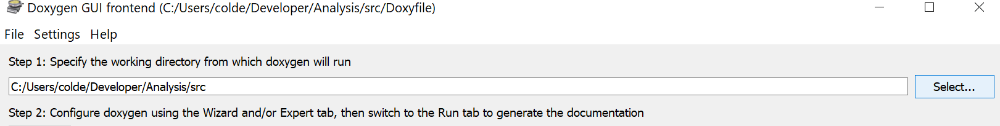

Navigate to your local copy of the Analysis repository,<br>
then click the <b>src</b> folder.<br>

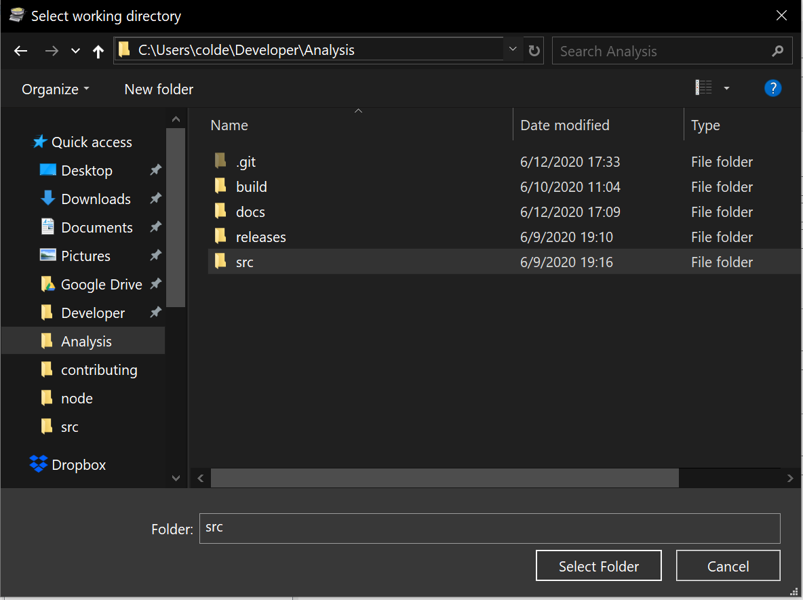

Then, underneath the 'Specify the directory to scan for source code',<br>
check off the 'Scan Recursively' option if it is not already checked off.<br>
Afterward, click the <b>Select...</b> button.<br>

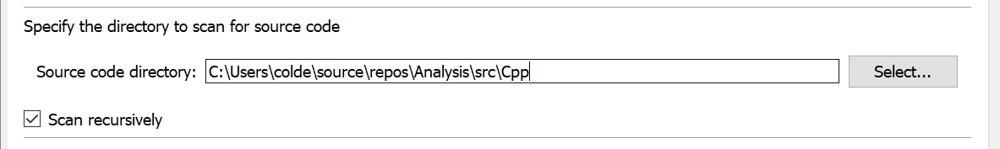
<b>Very important: make sure the 'Scan Recursively' option is checked off here.</b>

Verify that you are already in the <b>Analysis\src</b> directory.<br>
If not, navigate to that directory.<br>
Then, click the appropriate subdirectory within <b>src</b>.<br>
(Choose the directory of the <b>language</b> you wish to export documentation for)<br>

- Cinterface
- Csharp
- Python
- Cpp

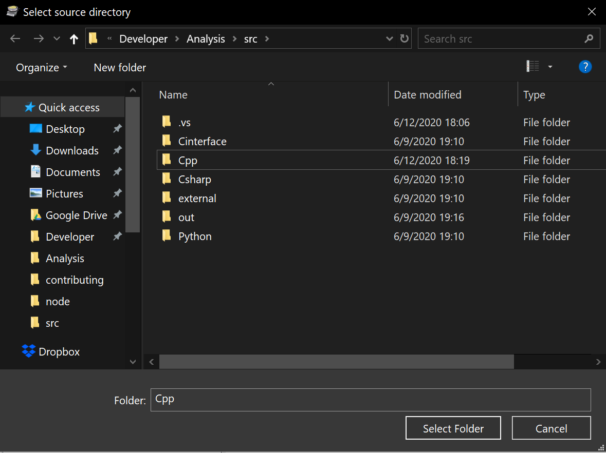
<b>For this example, the 'Cpp' folder was chosen. Select a different folder if you are exporting documentation for another language.</b>

Click one of the subdirectories above, then click <b>Select folder</b>.<br>

Finally,<br>
underneath 'Specify the directory where doxygen should put the generated documentation',<br>
click the <b>Select...</b> button.<br>

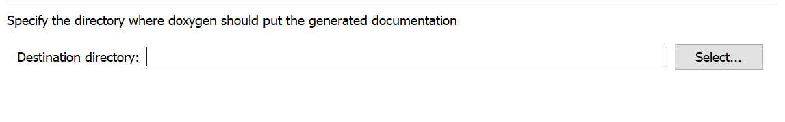

For test runs (always do test runs first before pushing anything to the repository),<br>
navigate to a directory of your choice (outside of your local copy of <b>Analysis</b>),<br>
then click <b>Select Folder</b>.<br>

Suggestion:<br>
Create a directory on your Desktop, and select that directory as the export destination.<br>

For any documentation that has been verified and destined for the repository,<br>
navigate to <b>Analysis\docs\language</b>, then click <b>Select Folder</b>.<br>

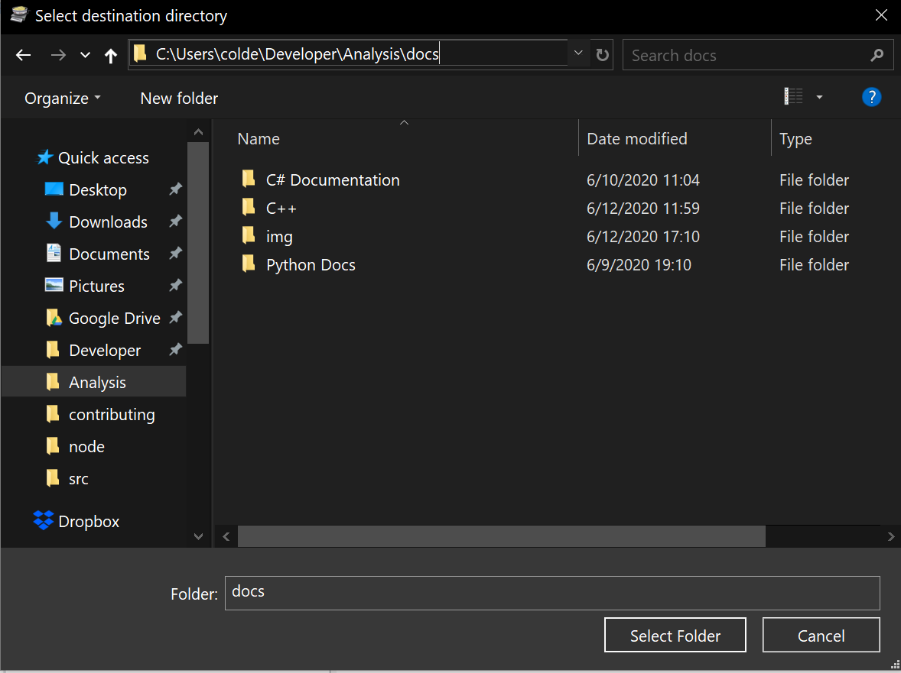

Remember to choose the current <b>language</b> subdirectory before clicking <b>Select Folder</b>.<br>
- C# Documentation
- C++
- Python Docs

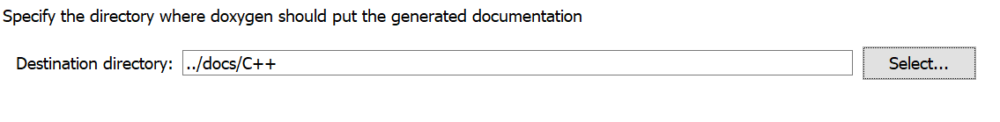
<b>Be sure to select 'C# Documentation' or 'Python Docs' if you are not exporting documentation for C++.</b>

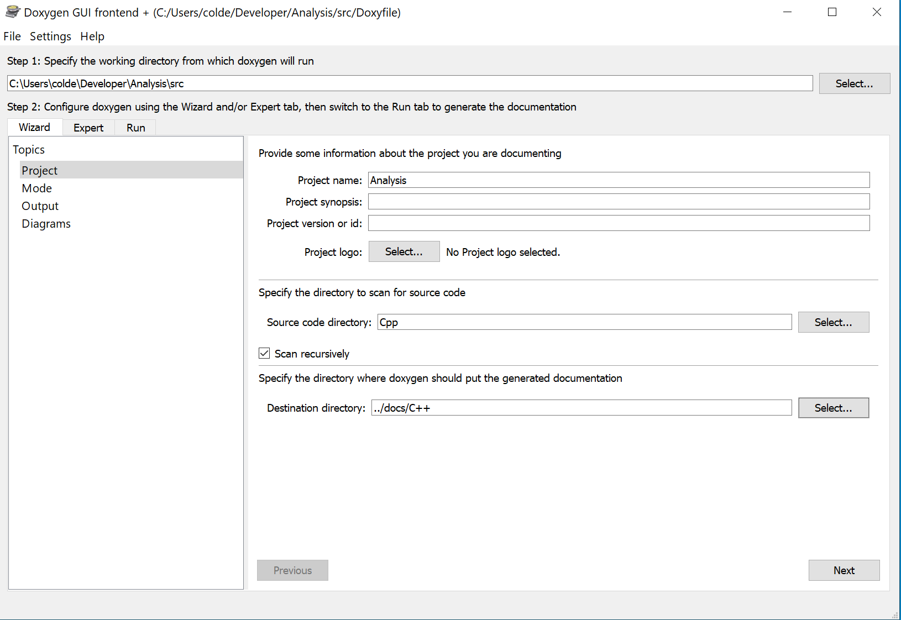
<b>This is how the 'Wizard' page for Doxywizard may look for a C++ documentation export.</b>

<b>Step 3:</b><br>
We are now able to define where Doxygen will search for images.<br>

Click the <b>Expert</b> tab.<br>


Underneath <b>Topics</b> (on the left hand side of the window),<br>
select <b>Input</b>,<br>


then on the right side,<br>
scroll down until you see the text field for <b>IMAGE_PATH</b>.<br>


Click the folder icon for <b>IMAGE_PATH</b>.<br>


In the file explorer window that appears,<br>
navigate to <b>Analysis\docs</b>.<br>
Then, click <b>Select Folder</b>.<br>

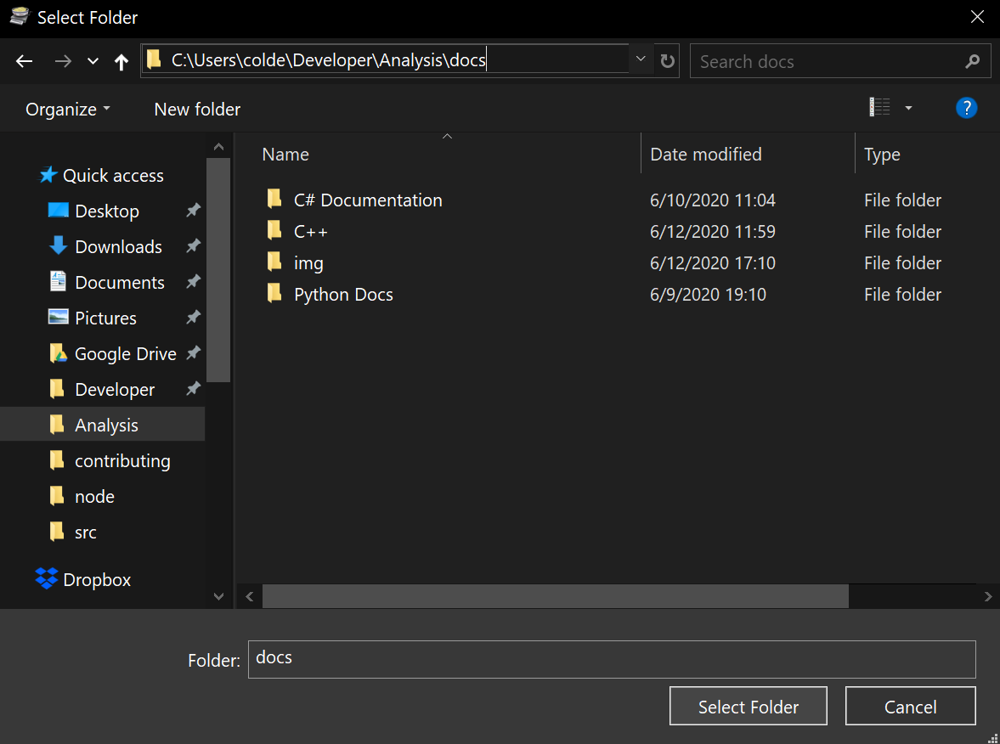

We have now configured our image path for Doxygen.<br>

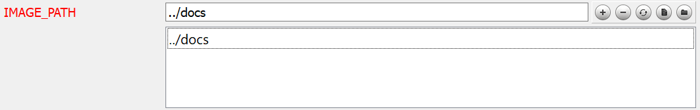
<b>When Doxygen inserts images into documentation, it will begin its search in the Analysis\docs directory.</b>

<b>Step 4:</b><br>

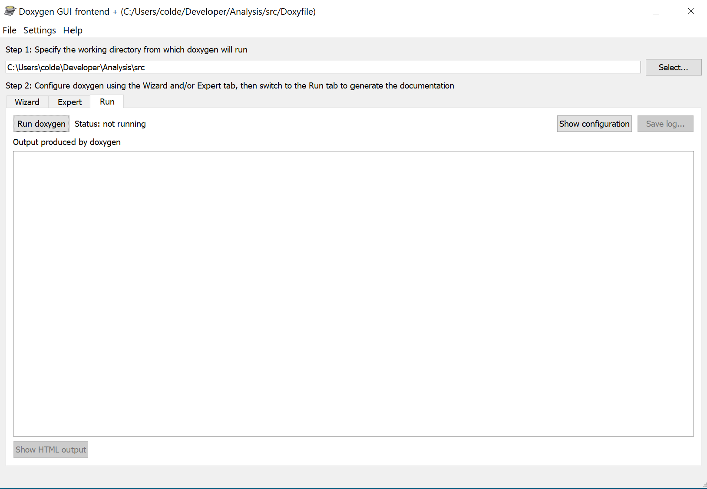

If there is nothing else you would like to configure,<br>
select the <b>Run</b> tab, then click <b>Run doxygen</b>.<br>

Your documentation will now be generated.

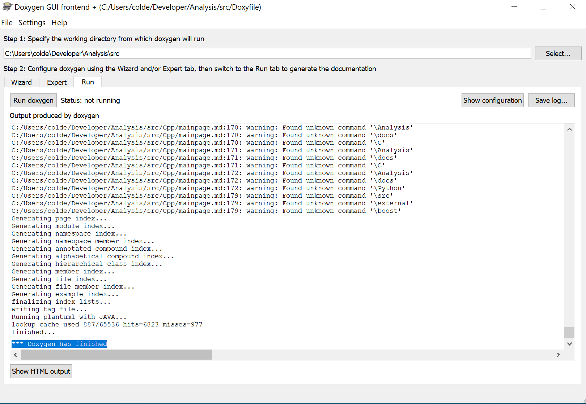

Here are some examples for inserting an image into <code>node.h</code>,<br>
and <code>mainpage.md</code>.


<b><code>\image</code> tag was used within <code>node.h</code>.</b>


<b>Markdown syntax for images was used for <code>mainpage.md</code>.</b>

<h2>Why the use of <code>///</code> and <code>//</code>?</h2>

It may seem pedantic to insist on using <code>///</code> for the entire code sample,
<br> and <code>//</code> for comments within the sample -- but there is a reason
for this.<br>

As you may know, there are many ways to invoke a comment in C++,<br>
particularly for use with Doxygen -- such as:<br><br>
<code>/* A C-style comment */</code><br>
<code>/*! Qt variant of a C-style comment */</code><br>
<code>// C++ style double-slash comment</code><br>
<code>/// C++ style triple-slash comment</code><br>

You can read more about the specifics of Doxygen-legal comment styling here:
https://www.doxygen.nl/manual/docblocks.html

<b>The use of <code>///</code> for the entirety of the code sample,<br>
because it permits the use of <code>//</code> within the code sample whenever
necessary.</b>This is important for including comments within your code sample.<b>

If, for example, your code sample were to look like this:<br>

<code>/// \code{.cpp}
/*!
std::cout << "Here is my sample" << std::endl;
// Here is a comment
*/</code>

...the final Doxygen HTML export would look like this:<br>

<code>
@verbatim
        std::cout << "Here is my sample" << std::endl;
@endverbatim
Here is a comment</code>

It seems that Doxygen will have issues with differentiating comments<br>
within the code sample, with a comment that would end the code sample.<br>

It is unclear as to why the <code>@verbatim</code> and <code>@endverbatim</code>
tags appear in place of <code>/*!</code> and <code>/*</code> respectively --<br>
but if the convention described above is used, particularly if comments are to<br>
be included in the code sample, there will be no issues.<br>
