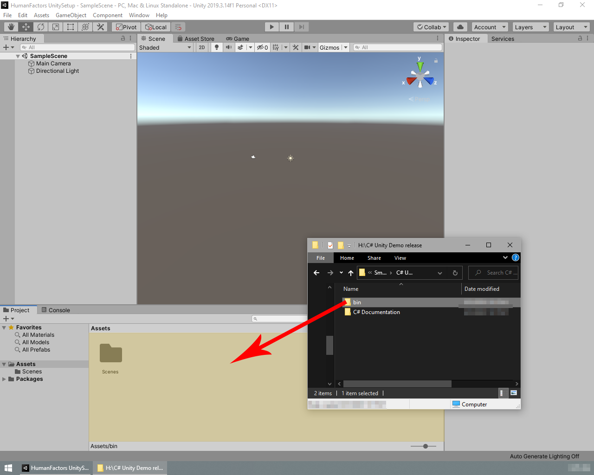
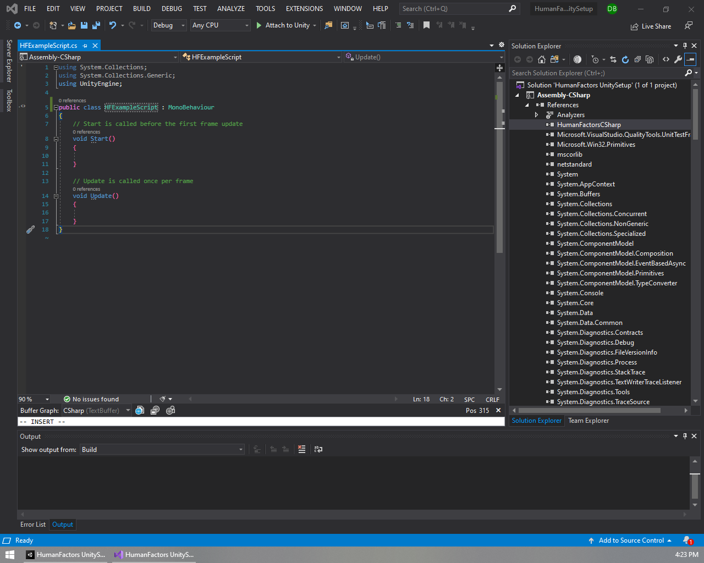
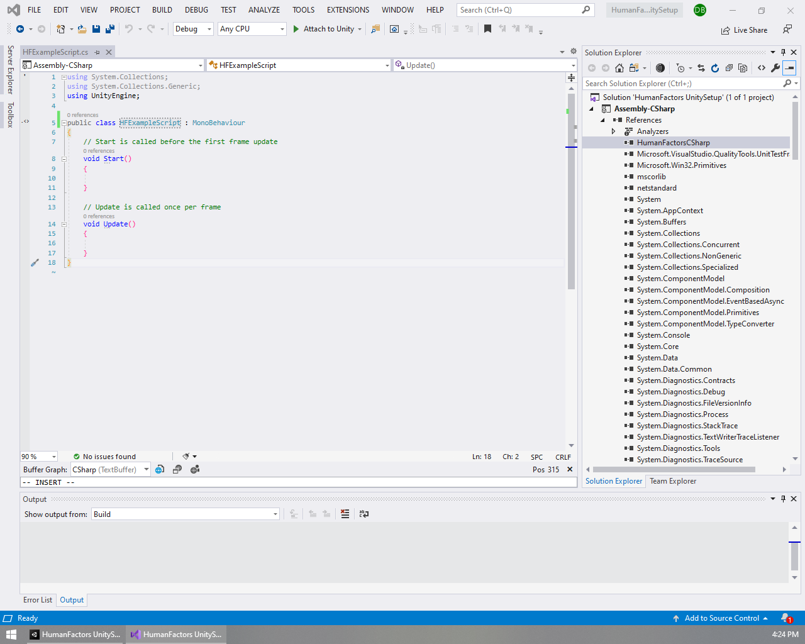

# Setting Up a Unity Project for Human Factors

Next Tutorial: [Project Setup](1_unity_project_setup.md)

- [Setting Up a Unity Project for Human Factors](#setting-up-a-unity-project-for-human-factors)
  - [Before we begin](#before-we-begin)
    - [Prerequisites](#prerequisites)
  - [Creating a new project](#creating-a-new-project)
  - [Importing the Human Factors Library](#importing-the-human-factors-library)
  - [Verifying Unity can reference HumanFactors](#verifying-unity-can-reference-humanfactors)
  - [Conclusion](#conclusion)

## Before we begin

 This guide will demonstrate setting up a new Unity project from scratch, importing the HumanFactors API as an asset, then verifying the Unity project can reference it.

 In this guide we will cover the following:

1) Creating a new Unity project.
2) Importing HumanFactors to a Unity project.
3) Verifying that a Unity project code can reference HumanFactors.

### Prerequisites

- An installation of [Unity](https://unity3d.com/get-unity/download). This tutorial has been tested with Unity 2019.3f, but should work from 2018.3 on.
- An installation of Visual Studio with Unity integration. Instructions for installing Unity with support for Visual Studio or adding VisualStudio support to an existing installation of Unity are available [here](https://docs.microsoft.com/en-us/visualstudio/cross-platform/getting-started-with-visual-studio-tools-for-unity?view=vs-2019).
- A copy of the HumanFactors release built with support for C#. The `bin` folder of the release should contain the following files:
  1. embree3.dll
  2. HumanFactors.dll
  3. HumanFactorsCSharp.dll
  4. msvcp140.dll
  5. System.Buffers.dll
  6. System.Memory.dll
  7. System.Runtime.CompilerServices.Unsafe.dll
  8. tbb.dll
  9. vcomp140.dll
  10. vcruntime140.dll
  11. vcruntime140_1.dll

## Creating a new project

*Figure* **1.1**: *Creating a new project in the Unity Hub*

To begin, open the Unity Hub then click the *NEW* button to create a new project.

*Figure* **1.2**: *The Create a Project Dialog*

Select your desired project type, directory, and project name. For the sake of this tutorial, we will be using the *3D* project type and naming our project *HumanFactorsUnitySetup*. When done with this, press the *Create* button to create the project and wait while Unity imports all the necessary files.

*Figure* **1.3**: *An empty Unity scene*

Upon completion you should be greeted by an empty Unity scene.

## Importing the Human Factors Library

Now that we have created a blank project, we need to import the HumanFactors' binaries as assets so Unity can see and interface with them.

*Figure* **1.4**: *Dragging the HumanFactors bin folder into the Unity Project*

Unzip the HumanFactors release package to another location (Don't try to drag and drop assets from a zipped folder, you will get an error), then, as shown in Figure 1.4, drag the `bin` folder from the location you extracted the release to into the Unity Editor's assets window. Once you've done this, Unity should display the *bin* folder alongside the existing *Scenes* folder.

## Verifying Unity can reference HumanFactors

The binaries have been added to our project as assets, but let's make sure Unity is able to reference them in code. To verify that Unity can reference the HumanFactors binaries, we're going to create a new script and look at its references. If we did everything correctly, Unity should automatically have added HumanFactorsCSharp as a reference.

*Figure* **1.5**: *Creating a new C# Script*

Right click on a blank space in the assets window, hover over *Create*, then click *C# Script*.

*Figure*  **1.6**: *Renaming a new script*

Looking in the assets window, you should notice a new script file next to Scenes directory titled NewBehaviourScript.cs by default, and the name of it is highlighted in blue indicatign that you can rename it. Rename the script to HFExampleScript.cs.

>**NOTE:** If you didn't name the file properly, don't worry. You can change the name of the script by right clicking on it and clicking *Rename*.
>

*Figure* **1.7**: *HFExampleScript.cs in the assets window*

Now that we have our new script, double click on it to open Visual studio.

*Figure* **1.8**: *Viewing the references of a project in Visual Studio*

In Visual Studio, navigate to the *Solution Explorer* then expand the drop downs for your solution, Assembly-C-Sharp, and References. If everything was done correctly, you should see HumanFactors C# under the references for your project, as shown in Figure 1.8.

> **NOTE**: If Mono-Develop appears instead of Visual Studio, then your installation of Unity is not set up to support Visual Studio. You can follow the above instructions from [Prerequisites](#prerequisites) to fix this.

> **NOTE**: If you renamed the file earlier, then your class's name may not match the name of the class in Figure 1.8. To fix this, just replace the class's name with `HFExampleScript.cs` on line 5. 
> 

>**NOTE:** Your version of Visual Studio may use the light theme by default like pictured below. This is purely visual and will not have any impact on this tutorial.
> 

If you see HumanFactors in your project's references, then you've successfully imported the HumanFactors library and are ready to start using the HumanFactors library.

## Conclusion

Below is a link to the unity project created in this tutorial.

[Tutorial 1: Unity Project Setup](../assets/walkthroughs/unity/1_project_setup/Tutorial%201-%20Unity%20Project.zip)

In this tutorial, we went through the process of creating unity project and adding the Analysis toolkit to the project. In the following tutorials, we will use this basis for using the modules that come with the Analysis toolkit.

In the next tutorial: [Using the Raytracer](2_raycast_at_plane.md) we will use HumanFactors to create a plane, cast a ray at it, then get the point where the ray intersected the plane.
