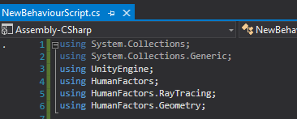
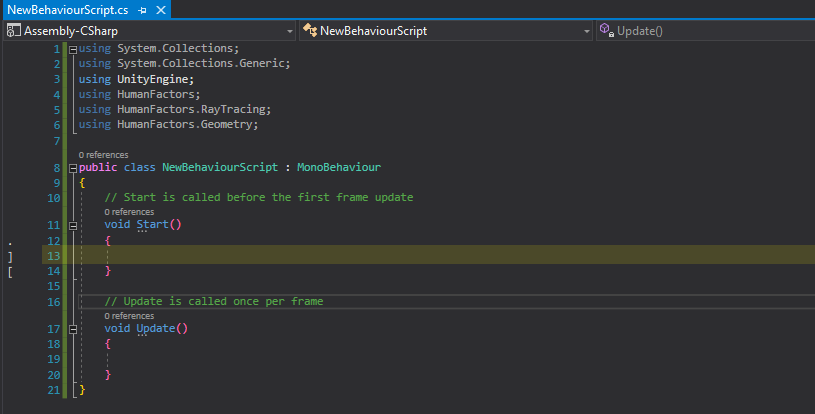
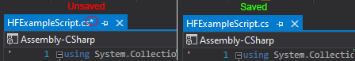
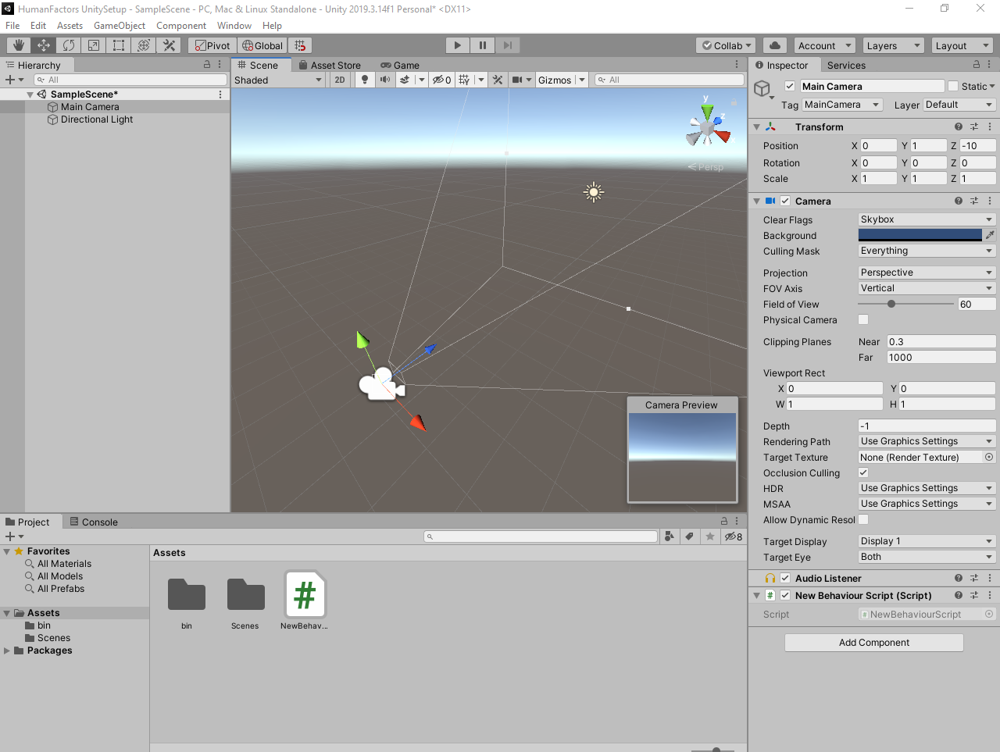
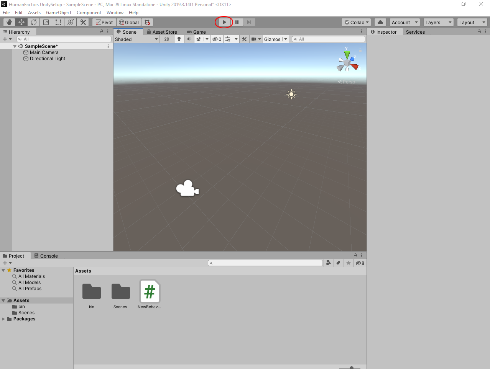
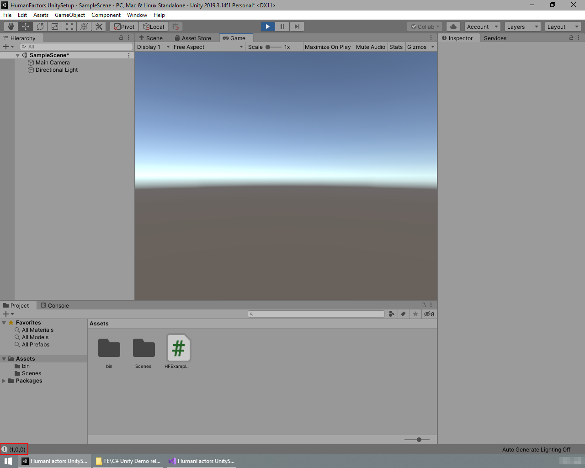
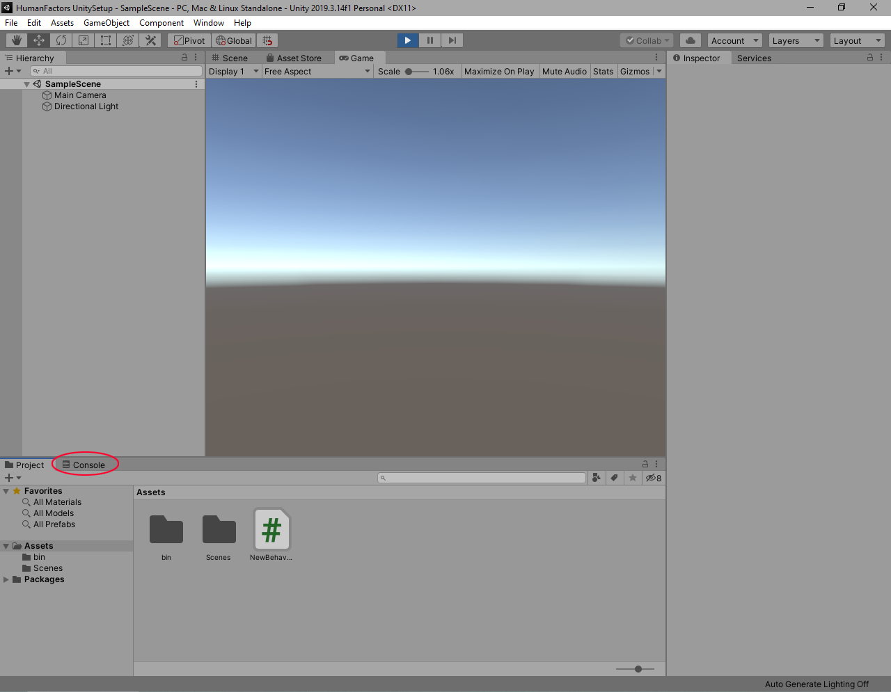

# Using the RayTracer

Previous Tutorial: [Project Setup](1_unity_project_setup.md)
|
Next Tutorial: [Graph Generator](3_graph_generator.md)

- [Using the RayTracer](#using-the-raytracer)
  - [Intro](#intro)
  - [Writing the Script](#writing-the-script)
    - [Using Declarations](#using-declarations)
    - [Creating a Plane](#creating-a-plane)
    - [Casting a Ray](#casting-a-ray)
    - [Wrapping Up](#wrapping-up)
  - [Testing](#testing)
    - [Adding the script to the camera](#adding-the-script-to-the-camera)
    - [Executing the Script](#executing-the-script)
  - [Conclusion](#conclusion)

## Intro

Now that we know the HumanFactors library can be referenced by our new Unity Project, lets check to see that it's working by writing a simple script that utilizes the Raytracer. Ray intersections are used internally by many of the analysis methods in HumanFactors, and can be a very useful tool for analyzing space. In this tutorial we will write a script that performs following when playmode is entered:

1) Create a Plane in HumanFactors from vertices and triangle indexes.
2) Cast a ray at the plane.
3) Print the point where the ray intersected the plane.

This tutorial assumes that you've completed the first tutorial, since we will be using the project created in it as a base, and building upon concepts first established there. If you want to start here, you can download the full unity project at the end of the previous tutorial.

Now, let's begin writing our script.

## Writing the Script


*Figure* **2.1**: *A Blank MonoBehavior Script*

In the Visual Studio window you've just opened, Look at the contents of the NewBehaviorScript.cs script we created in the last tutorial. The contents of your script should match that of Figure 2.1. Once you're sure of this, it's time to start filling it in.

### Using Declarations

Before getting into the logic of the script itself, we will add using declarations for the namespaces in HumanFactors that we plan to reference in this script.

Add the following lines to the top of the script.

``` C#
using HumanFactors;
using HumanFactors.RayTracing;
using HumanFactors.Geometry;
```




*Figure* **2.2**: *The Using declarations required for this script*

Lines, 1-6 of your code should match Figure 2.2.

>**NOTE:** While editing your code, you may notice the colored bar to the left between the line numbers and the code itself. This bar displays the changes you've made to the current document. When you make unsaved changes the bar will appear and be colored yellow,  then once you save it will turn green.



*Figure* **2.3**: *The body of the Start method highlighted*

With using declartions in place, we'll be writing the rest of our code in the body of the `Start()` function beginning on line 13. This section is highlighted in yellow in Figure 2.3. Next we will move onto creating a plane in code.

### Creating a Plane

To create any mesh we require two arrays:

1) An array of floats containing the (x,y,z) location of every vertex in the mesh.
2) An array of Integers containing the indexes for each triangle or "face" of the mesh.

A plane is comprised of four vertices, and two triangles. Here are the vertex and index arrays for a 10x10 plane on the xy plane.

``` C#
        // Create arrays for the plane's vertices and indices
        float[] plane_vertices = {
            -10f, 10f, 0f,
            -10f, -10f, 0f,
             10f, 10f, 0f,
             10f, -10f, 0f
        };
        int[] plane_indices = {
          3, 1, 0,
          2, 3, 0
        };
```

In both arrays, every 3 elements represents a seperate object. So the first vertex, is at location (-10,10,0) and the first triangle is comprised of the fourth, second, and first vertices. For more information on what both of these arrays mean, see out the [MeshInfo Documentation]().

**TODO**: Replace these links with links to our documentation.

We will use these arrays to construct a new *MeshInfo* object in HumanFactors. Call the MeshInfo constructor with the two arrays we defined above as arguments.

``` C#
        // Construct a meshinfo instance for the plane
        MeshInfo Plane = new MeshInfo(plane_indices, plane_vertices);
```

HumanFactors now has that plane we just created, but the mesh itself cannot be used with the Raytracer. We'll first need to generate a Bounding Volume Hierarchy, or BVH from the mesh if we want to perform ray intersections with it. In short, a BVH is an accelerated data structure that drastically reduces the time required to perform ray intersections. You can read more about the BVH in its dedicated article [Bounding Volume Hierarchy]().

To generate a BVH from an instance of MeshInfo, call the BVH constructor with the MeshInfo instance as an argument.

``` C#
        // Generate a BVH from the MeshInfo instance
        EmbreeBVH bvh = new EmbreeBVH(Plane);
```

At this point, our start function should match the following code:

``` C#
    void Start()
    {
        // Create arrays for the plane's vertices and indices
        float[] plane_vertices = {
            -10f, 10f, 0f,
            -10f, -10f, 0f,
             10f, 10f, 0f,
             10f, -10f, 0f
        };
        int[] plane_indices = {
          3, 1, 0,
          2, 3, 0
        };

        // Generate a BVH from the MeshInfo instance
        MeshInfo Plane = new MeshInfo(plane_indices, plane_vertices);

        // Construct a meshinfo instance for the plane
        EmbreeBVH bvh = new EmbreeBVH(Plane);
    }
```

[Image in Visual Studio](../assets/walkthroughs/unity/2_raycast_at_plane/creating_a_plane.png)

With the BVH created, we're ready to call the Raytracer and cast a ray.

### Casting a Ray

We'll put the origin point of the ray at (1,0,1) and cast it in the direction (0,0,-1). This should intersect with the plane we defined earlier at the point (1,0,0). In the start function just below the the line we create the BVH, define an origin point and a direction for the ray.

``` C#
        // Define origin and direction
        Vector3D origin = new Vector3D(1, 0, 1);
        Vector3D direction = new Vector3D(0, 0, -1);
```

Depending on which function you call, the EmbreeRaytracer can return 3 different types of information:

1) The coordinates where a ray intersected the bvh.
2) The distance from the ray's origin to the point where it intersected the BVH
3) A boolean true/falue for whether or not the ray intersected.

For this guide we will use [IntersectForPoint]() to get the point where the ray intersects the mesh. Starting on line 30 call the EmbreeRayTracer's **IntersectForPoint** function with the bvh, origin and direction as arguments.

``` C#
        // Cast the ray, store the hitpoint.
        Vector3D intersection_point = EmbreeRaytracer.IntersectForPoint(bvh, origin, direction);
```

Finally, log the point of intersection to Unity's console using `Debug.Log()` so we can see it.

``` C#
        // Print the x, y, and z components of the intersection point
        Debug.Log(
            "(" + intersection_point.x +
            "," + intersection_point.y +
            "," + intersection_point.z +
        ")");
```

Here's all of that together:

``` C#
        // Define origin and direction
        Vector3D origin = new Vector3D(1, 0, 1);
        Vector3D direction = new Vector3D(0, 0, -1);

        // Cast the ray, store the hitpoint
        Vector3D intersection_point = EmbreeRaytracer.IntersectForPoint(bvh, origin, direction);

        // Print the x, y, and z components of the intersection_point
        Debug.Log(
            "(" + intersection_point.x +
            "," + intersection_point.y +
            "," + intersection_point.z +
        ")");
```

[Image of our Start() function up until this point](../assets/walkthroughs/unity/2_raycast_at_plane/casting_a_ray.png)

### Wrapping Up

Here is the final script we've been building in this tutorial.

``` C#
using System.Collections;
using System.Collections.Generic;
using UnityEngine;
using HumanFactors;
using HumanFactors.RayTracing;
using HumanFactors.Geometry;

public class HFExampleScript : MonoBehaviour
{
    // Start is called before the first frame update
    void Start()
    {
        // Create arrays for the plane's vertices and indices
        float[] plane_vertices = {
            -10f, 10f, 0f,
            -10f, -10f, 0f,
             10f, 10f, 0f,
             10f, -10f, 0f
        };
        int[] plane_indices = {
          3, 1, 0,
          2, 3, 0
        };

        // Generate a BVH from the MeshInfo instance
        MeshInfo Plane = new MeshInfo(plane_indices, plane_vertices);

        // Construct a meshinfo instance for the plane
        EmbreeBVH bvh = new EmbreeBVH(Plane);

        // Define origin and direction
        Vector3D origin = new Vector3D(1, 0, 1);
        Vector3D direction = new Vector3D(0, 0, -1);

        // Cast the ray, store the hitpoint
        Vector3D intersection_point = EmbreeRaytracer.IntersectForPoint(bvh, origin, direction);

        // Print the x, y, and z components of the intersection_point
        Debug.Log(
            "(" + intersection_point.x +
            "," + intersection_point.y +
            "," + intersection_point.z +
        ")");
    }

    // Update is called once per frame
    void Update()
    {

    }
}
```

Once you've verified your code matches, ***make sure to save the script  by clicking File then Save in the top menu or pressing Ctrl + S on your keyboard.*** Unity will NOT be able to use the script unless you save it. If you're unsure, the bar on the left hand side between your code and the line numbers should be solid green, and the title of your assembly should not have an asterisk next to it.



## Testing

Now that we have a usable script, we need to attach it to some game object in order to run it. Lets minimize the Visual Studio window and go back to the Unity Editor.

### Adding the script to the camera

In the Unity window drag *HFExampleScript.cs* to *Main Camera* in the scene hierarchy.


After doing this, it may look like nothing happened, but by dragging NewBehaviorScript over the camera you've added NewBehaviorScript to the camera as a component. You can verify this by Left Clicking the camera in the scene hierarchy and looking at its components in the Inspector on the right sidebar.

>**NOTE**: If you don't see the inspector in the right sidebar, you can enable it by selecting Window > General > Inspector from the top menubar. 



At the bottom of the Inspector you should see a header for HF Example Script. Once you've made sure it exists, you can click on an empty space in the scene view to deselect the camera.

>**NOTE**: If you click on the camera and notice multiple copies of the script, you can remove a component by left clicking on the rightmost side of header for the components of the extra scripts in the inspector, then click the remove component button.
>

### Executing the Script

Now that we've set *NewBehaviorScript* as a component of the *Main Camera*, its `Start()` function containing our code will run when the editor enters play mode. To enter playmode, press the play button located at the top center of your screen.



Once clicked, you will enter play mode, and the button will turn blue.

>**NOTE:** If when entering play mode, the game window becomes full screen like below, that means you have the *Maximize On Play* option enabled. You can disable it by pressing the  *Maximize On Play* button circled in red below. For this tutorial series, we will leave this option off since it hides the console.


If everything went right, after entering play mode the console located at the bottom of your editor's window should show `(1,0,0)`, which is the exact point where the ray intersected the plane.



*Figure* **2.4A**

Figure 2.4B is a magnified version of the console's output enclosed by the red box shown in 2.4A.


*Figure* **2.4B**

>**NOTE**: If you see no output at all, that likely means your version of Unity has log messages disabled. To enable log messages click on the Console tab just above the assets window to open the console.
> 
> After this, you should notice the three buttons in the top right of the console window. The Left most button with an exclamation point in a speech bubble should be greyed out. Click on this button to enable log messages.
> 
> You will see your output in the space where the assets tab occupied, instead of the bottom bar. You can switch back to the assets window by clicking the project tab to the left of the console tab.
> 
> Future calls to `Debug.Log()` will appear at the bottom of the screen like shown in Figure 2.4.

If your console's output matches this, then you're successfully completed this tutorial. You can press the play button again to exit playmode.

## Conclusion

Full project Link: [Tutorial 2: Casting a Ray at A Plane](../assets/walkthroughs/unity/2_raycast_at_plane/Tutorial%202%20-%20Unity%20Project.zip)

In this tutorial we've successfully created a plane from an array of vertices and triangle indexes, then casted a ray at it, then found the point where the ray and the plane intersected. Through this we've gained some experience using Visual Studio with Unity and became more familiar with the Editor's UI. In the next tutorial we will build upon this experience to cover a core part of the HumanFactors Library: The [Graph Generator](3_graph_generator.md).
