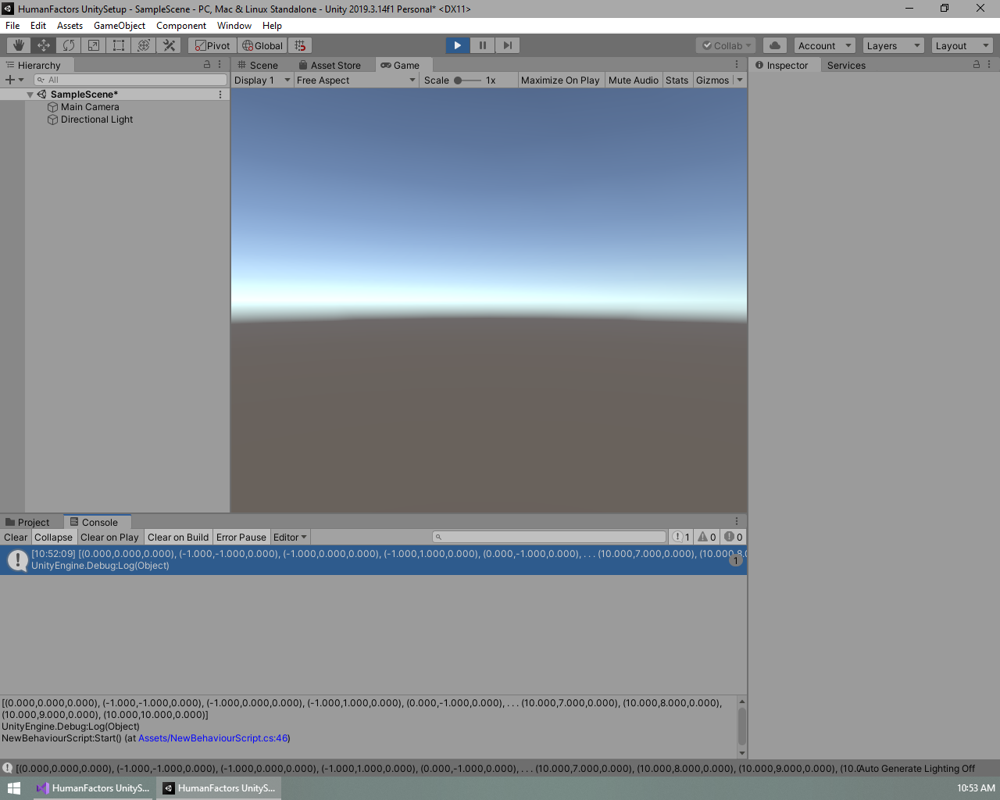

# Using the Graph Generator

Previous Tutorial: [Using the Raytracer](2_raycast_at_plane.md)
|
Next Tutorial: [Passing a Mesh From Unity to HumanFactors](4_reading_mesh_from_unity.md)

- [Using the Graph Generator](#using-the-graph-generator)
  - [Intro](#intro)
    - [Conceptual Overview](#conceptual-overview)
  - [First Graph Generation](#first-graph-generation)
    - [Creating the Plane](#creating-the-plane)
    - [Generating the Graph](#generating-the-graph)
    - [Checking for success](#checking-for-success)
    - [Retrieving A list of nodes](#retrieving-a-list-of-nodes)
    - [Save and Test](#save-and-test)

## Intro

This tutorial picks up from where [Tutorial 1: Unity Project Setup](1_unity_project_setup.md) ended. If you are just beginning here, then you can download the Unity project from the bottom of tutorial 1.

### Conceptual Overview

To put it simply, the **Graph Generator** maps out "accessible" space on a model from a given starting point. As the name implies, this map of the space is stored as a series of nodes and edges in a **Graph**. Each node represents a point in space that a human can occupy, and each edge between nodes indicates that a human can traverse from one node to another node. The Graph Generator is a powerful tool for analyzing space, since the graph or nodes it outputs can be used as input to all of the analysis methods offered by HumanFactors. This allows the user to go straight from modifying a model or scene, to analyzing it with minimal effort.

## First Graph Generation

For now, we will begin with minimum required settings, then work our way up to examples that make use of the GraphGenerators optional settings. To generate a graph at minimum, the following arguments are requried:

1) A BVH containing the mesh you want to use for graph generation.
2) A starting point.
3) The spacing nodes.

To get started, we will once again set up our using declarations to import the functionality we need.

``` C#
using HumanFactors;
using HumanFactors.Geometry;
using HumanFactors.SpatialStructures;
using HumanFactors.GraphGenerator;
using HumanFactors.RayTracing;
```


### Creating the Plane

Internally, the graph uses the *EmbreeRayTracer* which requires a BVH, so we can follow the process as the [previous tutorial](2_raycast_at_plane.md) to create a BVH for it. For the purposes of this tutorial we will use a plane that is 10mx10m instead of 20mx20m, and oriented on the xy plane instead of the yz plane.

In the start function add the following code:
``` C#
        // Create an array of a plane's vertices and indices
        float[] plane_vertices = {
            -10f, 10f, 0f,
            -10f, -10f, 0f,
             10f, 10f, 0f,
             10f, -10f, 0f
        };
        int[] plane_indices = { 3, 1, 0, 2, 3, 0 };

        // Send them to HumanFactors
        MeshInfo Plane = new MeshInfo(plane_indices, plane_vertices);

        // Generate a BVH for the RayTracer
        EmbreeBVH bvh = new EmbreeBVH(Plane);
```

Our Start() function should look like this at the end of this section.


### Generating the Graph

Now that we have the geometry we are going to traverse, let's generate a graph on it. In the code below, we define a starting point for the graph, then we define the spacing between each node. Lower spacing results in a larger, more detailed graph, while higher spacing creates smaller less detailed graphs. For now, we will keep the spacing at 1m in all directions.

Enter this code below the BVH code from the previous section.

```C#
        // Set Options for the Graph Generator
        Vector3D start_point = new Vector3D(0, 0, 1); // The point to start thegraph generation
        Vector3D spacing = new Vector3D(1, 1, 1); // The spacing between each node

        // Generate the Graph
        Graph G = GraphGenerator.GenerateGraph(bvh, start_point, spacing);
```


### Checking for success

Before moving any further, we need to check if the graph generator was able to generate a graph from our input. If the GraphGenerator could not generate any connections from the start point, or the start point was not over any solid ground, the graph will fail to generate and the Graph Generator will return a null value. Let's add a null check before interacting with the graph any further.

``` C#
        // Check if the graph generator succeeded
        if (G is null) {
            Debug.Log("The Graph failed to generate.");
            return;
        }
```


Now, if the graph fails to generate we will get a nice error message instead of later getting a null reference exception when we try to interact with it.

### Retrieving A list of nodes

If the code has advanced past the null check, that means the GraphGenerator was successful and G now contains a graph of the accessible space on Plane. For this demo we will get a list of all nodes within the graph, and print them to get an idea of where this graph traversed.

``` C#
        // Get a list of nodes from the graph and print them.
        NodeList nodes = G.getNodes();
        Debug.Log(nodes);
```


### Save and Test

This script is ready to go. Save your script, minimize Visual Studio, then switch back to the Unity Editor. The process for testing this script is identical to the previous tutorial. Attach the script to the main camera, then press the play button and inspect your output.


If you want a better view, you can click on the output to switch over to the console tab, then click on the message containing our output for a closer look. To switch back to the previous view, you can click on the "Project" tab just above the console window.




Note that this is not the full list of nodes due to the size of the output. 