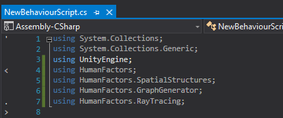
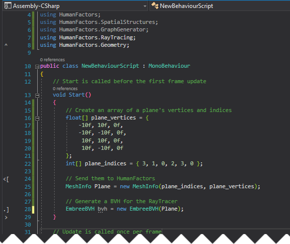
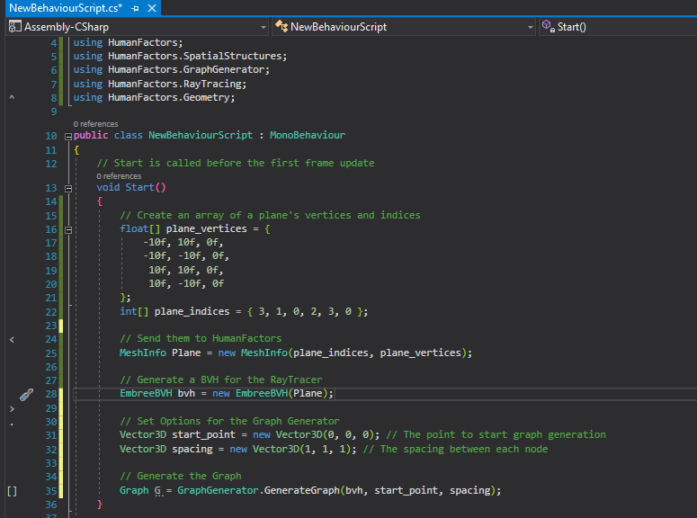
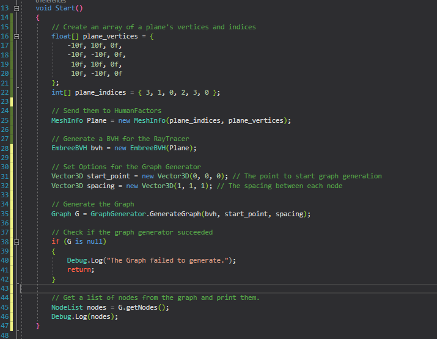
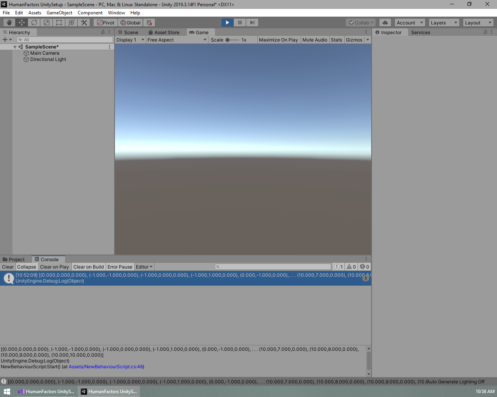
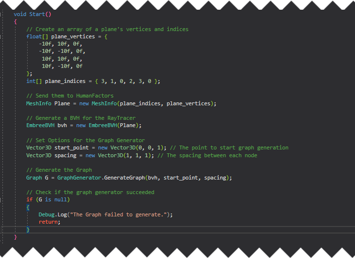

# Using the Graph Generator

Previous Tutorial: [Using the Raytracer](2_raycast_at_plane.md)
|
Next Tutorial: [Passing a Mesh From Unity to HumanFactors](4_reading_mesh_from_unity.md)

- [Using the Graph Generator](#using-the-graph-generator)
  - [Intro](#intro)
    - [Conceptual Overview](#conceptual-overview)
  - [Simple Graph Generation](#simple-graph-generation)
    - [Creating the Plane](#creating-the-plane)
    - [Generating the Graph](#generating-the-graph)
    - [Retrieving A list of nodes](#retrieving-a-list-of-nodes)
    - [Save and Test](#save-and-test)
  - [Cases where the GraphGenerator fails](#cases-where-the-graphgenerator-fails)
    - [Checking for success](#checking-for-success)
  - [Conclusion](#conclusion)

## Intro

This tutorial picks up from where [Tutorial 1: Unity Project Setup](1_unity_project_setup.md) ended. If you are just beginning here, then you can download the Unity project from the bottom of tutorial 1.

In this tutorial we will cover the following:

1) Calling the GraphGenerator with a bvh, spacing, and a start point.
2) Reading nodes from a graph after it has been generated.
3) Handling cases where the GraphGenerator could not generate a graph.

### Conceptual Overview

To put it simply, the **Graph Generator** maps out "accessible" space on a model from a given starting point. As the name implies, this map of the space is stored as a series of nodes and edges in a **Graph**. Each node represents a point in space that a human can occupy, and each edge between nodes indicates that a human can traverse from one node to another node. The Graph Generator is a powerful tool for analyzing space, since the graph or nodes it outputs can be used as input to all of the analysis methods offered by HumanFactors. This allows the user to go straight from modifying a model or scene, to analyzing it with minimal effort.

## Simple Graph Generation

For now, we will begin with the minimum required settings to run the Graph Generator then work our way up to examples that make use of the optional settings. To generate a graph at minimum, the following arguments are requried:

1) A BVH containing the mesh you want to use for graph generation.
2) A point to start graph generation at.
3) The spacing between nodes.

To get started, we will once again set up our using declarations to import the functionality we need.

``` C#
using HumanFactors;
using HumanFactors.Geometry;
using HumanFactors.SpatialStructures;
using HumanFactors.GraphGenerator;
using HumanFactors.RayTracing;
```



### Creating the Plane

Internally, the graph uses the *EmbreeRayTracer* which requires a BVH, so we can follow the process as the [previous tutorial](2_raycast_at_plane.md) to create a plane, then generate a BVH from it.

In the start function add the following code in the body of the Start function on line 13:

``` C#
        // Create the plane's vertex and index arrays
        float[] plane_vertices = {
            -10f, 10f, 0f,
            -10f, -10f, 0f,
             10f, 10f, 0f,
             10f, -10f, 0f
        };
        int[] plane_indices = {
           3, 1, 0,
           2, 3, 0
        };

        // Send them to HumanFactors
        MeshInfo Plane = new MeshInfo(plane_indices, plane_vertices);

        // Generate a BVH for the RayTracer
        EmbreeBVH bvh = new EmbreeBVH(Plane);
```



### Generating the Graph

Now that we have a BVH, let's generate a graph on it. In the code below, we define a starting point for the graph, then we define the spacing between each node.

We'll place our start point 1 meter above the origin of the scene (0,0,1). Starting directly at the origin, (0,0,0), would put the start point inside of the plane we're using for the ground, causing the initial ground check to fail.

```C#
        Vector3D start_point = new Vector3D(0, 0, 1);
```

We'll use a spacing of one meter in each direction, so each node in our graph will be at maximum one meter apart.

``` C#
        Vector3D start_point = new Vector3D(0, 0, 1);
```

Finally we will call the GraphGenerator with these arguments.

```C#
        // Generate the Graph
        Graph G = GraphGenerator.GenerateGraph(bvh, start_point, spacing);
```



### Retrieving A list of nodes

G now contains a graph of the accessible space on Plane using our settings. For this tutorial we will get a list of all nodes within the graph, and print them to get an idea of where this graph traversed.

``` C#
        // Get a list of nodes from the graph and print them.
        NodeList nodes = G.getNodes();
        Debug.Log(nodes);
```



### Save and Test

Here is the full script we've created from this demo. Make sure yours matches it before moving on to testing.

``` C#
using System.Collections;
using System.Collections.Generic;
using UnityEngine;
using HumanFactors;
using HumanFactors.SpatialStructures;
using HumanFactors.GraphGenerator;
using HumanFactors.RayTracing;
using HumanFactors.Geometry;

public class NewBehaviourScript : MonoBehaviour
{
    // Start is called before the first frame update
    void Start()
    {
        // Create an array of a plane's vertices and indices
        float[] plane_vertices = {
            -10f, 10f, 0f,
            -10f, -10f, 0f,
             10f, 10f, 0f,
             10f, -10f, 0f
        };
        int[] plane_indices = { 3, 1, 0, 2, 3, 0 };

        // Send them to HumanFactors
        MeshInfo Plane = new MeshInfo(plane_indices, plane_vertices);

        // Generate a BVH for the RayTracer
        EmbreeBVH bvh = new EmbreeBVH(Plane);

        // Set Options for the Graph Generator
        Vector3D start_point = new Vector3D(0, 0, 1); // The point to start graph generation
        Vector3D spacing = new Vector3D(1, 1, 1); // The spacing between each node

        // Generate the Graph
        Graph G = GraphGenerator.GenerateGraph(bvh, start_point, spacing);

        // Check if the graph generator succeeded
        if (G is null)
        {
            Debug.Log("The Graph failed to generate.");
            return;
        }

        // Get a list of nodes from the graph and print them.
        NodeList nodes = G.getNodes();
        Debug.Log(nodes);
    }

    // Update is called once per frame
    void Update()
    {

    }
}
```

Save your script, minimize Visual Studio, then switch back to the Unity Editor. The process for testing this script is identical to the process in the previous tutorial. Attach the script to the main camera, then press the play button and inspect your output.


Like in the previous tutorial, the output is at the bottom of the screen but it's cut off. To get a better view, click on the output to switch over to the console tab, then click on the message containing our output highlighted in blue for a closer look.



The highlighted text should read:

``` [(0.000,0.000,0.000), (-1.000,-1.000,0.000), (-1.000,0.000,0.000), (-1.000,1.000,0.000), (0.000,-1.000,0.000), . . . (10.000,7.000,0.000), (10.000,8.000,0.000), (10.000,9.000,0.000), (10.000,10.000,0.000)]```

> **Note:**  this is not the full list of nodes. The list has been truncated due to the size of the output. In order to view every node we'll have to print them in a loop.

Switch back to the previous view by clicking on the Project tab just above the blue highlighted message. In the above image this tab is circled in red. After this, exit playmode by clicking on the blue play button at the top of the screen.

## Cases where the GraphGenerator fails

We've covered situations where we know the GraphGenerator will generate a graph, however what about sitauations where 

### Checking for success

Before interacting with the returned value, we need to check if the Graph Generator was able to generate a graph from our input. If the Graph Generator could not generate any connections from the start point, or the start point was not over any solid ground, the graph will fail to generate and the Graph Generator will return a null value. Let's add a null check just after the graph is generated.

``` C#
        // Check if the graph generator succeeded
        if (G is null) {
            Debug.Log("The Graph failed to generate.");
            return;
        }
```



Now, if the graph fails to generate, Unity will print our nice error message and stop executing the script instead of later throwing a null reference exception when we try to interact with it.
## Conclusion

Here is a link the the full project created in this guide: [Full Project](../assets/walkthroughs/unity/3_graph_generator/Tutorial%203%20-%20Graph%20Generator.zip)

In the next tutorial, [Reading Meshes From Unity](4_reading_a_mesh_from_unity.md), we will use geometry from the unity scene to generate a graph, instead of generating our own plane. 