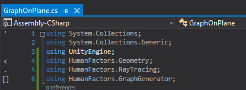

# Reading a Mesh From Unity {#MeshFromUnity}

Previous Tutorial: [The Graph Generator](@ref GeneratingAGraph)

- [Reading a Mesh From Unity {#MeshFromUnity}](#reading-a-mesh-from-unity-meshfromunity)
  - [Intro](#intro)
  - [Scene Setup](#scene-setup)
    - [Creating the Plane](#creating-the-plane)
    - [Resetting the Plane's Position](#resetting-the-planes-position)
  - [Writing the Script](#writing-the-script)
    - [Set Usings](#set-usings)
    - [Setup for adding references through the Unity Inspector](#setup-for-adding-references-through-the-unity-inspector)
  - [Passing Meshes from GameObjects to HumanFactors](#passing-meshes-from-gameobjects-to-humanfactors)
    - [Getting a reference to the mesh held by a specific Game Object](#getting-a-reference-to-the-mesh-held-by-a-specific-game-object)
      - [Background on Gameobjects and components](#background-on-gameobjects-and-components)
      - [Retrieving the Mesh from a GameObject](#retrieving-the-mesh-from-a-gameobject)
      - [Getting the vertices and triangles from a Unity Mesh](#getting-the-vertices-and-triangles-from-a-unity-mesh)
      - [Transforming the Mesh from Y-Up to Z-Up](#transforming-the-mesh-from-y-up-to-z-up)
  - [Executing the Script](#executing-the-script)
    - [Adding References Through the Unity Inspector](#adding-references-through-the-unity-inspector)
    - [Comparing Output](#comparing-output)

## Intro

In this tutorial we'll be using the project created in the previous guide: [The Graph Generator](3_graph_generator.md), and we'll be using concepts covered in the previous guides.

In this guide we will cover:

- Adding a game object to a script so it can be referenced by code.
- Accessing the components of a Game Object
- Transforming MeshInfo instances to Z-Up

## Scene Setup

Up until this point, we haven't needed to interact with the unity scene, aside from attaching a script to the camera that is placed by default. For us to demonstrate reading geometry from the scene, we must first create geometry in the scene. For this example, we will create a plane in unity instead of creating our own plane in code.

To begin, open the unity project from [Using The Raytracer](@ref UsingTheRayTracer) or [The Graph Generator](@ref GraphGenerator)


From here we will create a new Plane in the unity scene to match the plane we created in the previous examples.

### Creating the Plane


*Figure* **4.1**: *Creating a plane using the menu bar*

Using the menubar at the top of the screen select GameObject > 3D Object > Plane.

Once clicked, a new 10x10 plane will be created at the center of the scene window's view. The plane we created in code was centered on the origin, but this plane isn't since it was created where we were looking. We must reset this plane to the origin before moving any further.

### Resetting the Plane's Position


*Figure* **4.2**: *View the plane in the inspector*

Left Click on the newly created plane and look at **Transform** header in the Inspector located at the right sidebar.


*Figure* **4.3**: *Resetting the plane's position*

Under **Transform** you can see the plane's position, rotation and scale within the scene. To set the plane's position to the origin, left on the three dots to the right of the transform header, and select *Reset Position*.


*Figure* **4.4**: *The plane centered at the scene origin*

After clicking that button, your plane should be moved to the origin like in Figure 4.4. Note that the X, Y, and Z of the plane's position in the Inspector are all set to 0. Ensure that the rest of the variables in the transform header match that of Figure 4.4. Now that we have the plane ready to go, we can begin working on the script to get its vertices and triangles.

## Writing the Script

**TODO**: What should I say here? Should I offer two paths for tutorial 2A and 2B respectively? Or should I just tell people to use one or the other?

### Set Usings

Just like the previous tutorials, we're going to declare which namespaces this script will use in the using section. This script will require the same using declarations as the Graph Generator tutorial. 
``` C#
using HumanFactors;
using HumanFactors.Geometry;
using HumanFactors.RayTracing;
using HumanFactors.GraphGenerator;
using HumanFactors.SpatialStructures;
```

Your usings for this script should look like this.



*Figure* **4.5** *Using declarations for this script*

### Setup for adding references through the Unity Inspector


*Figure* **4.6**: *Script with a GameObject class member added*

There are many ways to reference a GameObject from a script, but for this example we'll be setting up our script so we can select which mesh we want to use to use from the scene in the Unity Inspector. Add GameObject a class member to the script on line 9.

``` C#
GameObject PlaneInScene;
```

Later we'll use the Unity Inspector to assign the plane in the scene to this GameObject.

## Passing Meshes from GameObjects to HumanFactors

Now that we have a reference to the Game Object we want to use; we need to get the raw vertices and faces of the plane so we can pass them to HumanFactors.

### Getting a reference to the mesh held by a specific Game Object

Before we can extract the triangles and vertices from one an instance of a Unity Mesh, we first need to get a reference to the Mesh itself. Doing this requires some understanding of Unity GameObjects and their components.

#### Background on Gameobjects and components


*Figure* **4.6**: *Components of the plane shown in the Unity Inspector*

Minimize Visual Studio then switch back to Unity for a moment. Clicking on the plane we created previously, then look at the at the Inspector on the right sidebar, as shown in Figure 4.6. Here you can view all information about the plane, such as its position, the material it uses, which mesh it's referencing, etc. but you'll notice the inspector is split into several sections: Transform, Meshfilter, Mesh Collider. Each of these sections are a separate **Component** and the object we see in the scene is just a container for those components called a [**GameObject**](https://docs.unity3d.com/Manual/class-GameObject.html). 

As stated in the Unity Documentation:

> *GameObjects are the fundamental objects in Unity that represent characters, props and scenery. They do not accomplish much in themselves, but they act as containers for Components, which implement the real functionality.*

What this means for us is that the plane we see in the scene is not a mesh, but a GameObject that contains a [MeshFilter](https://docs.unity3d.com/ScriptReference/MeshFilter.html) that contains a Mesh, like GameObject > Mesh Filter > Mesh. To obtain the Mesh itself, we must get it from the MeshFilter component of the plane GameObject. A game object's components can be retrieved using the [GetComponent](https://docs.unity3d.com/ScriptReference/GameObject.GetComponent.html) method.

#### Retrieving the Mesh from a GameObject

In our script we will store a reference to the plane's mesh filter in a variable named `PlaneFilter` at the beginning of the script's Start() function like so:

```C#
        MeshFilter PlaneFilter = PlaneReference.GetComponent<MeshFilter>();
```

Then we can access the actual mesh carried by `PlaneFilter` by calling its .mesh property:

``` C#
        Mesh PlaneMesh = Filter.mesh;
```

Now we have the plane as a mesh and are ready to get the required info from it for human factors.

#### Getting the vertices and triangles from a Unity Mesh

As previously stated, a mesh is comprised of an index and vertex array. To use this mesh in HumanFactors, we need to construct a MeshInfo object using these arrays. Fortunately, Unity provides a straightforward way to access the triangle indices of a mesh in a format that we can use for HumanFactors, but unfortunately the vertices only come in an array of Vector3, instead of the array of floats that we need. We will need to write a method to convert this array of Vector3 into an array of floats before we can use it in HumanFactors.

To simplify the process of converting the vertices to a suitable format, we will add a separate method called "Vector3ArrayToFloatArray" that will transform the array of Vector3 into an array of float ready for Human Factors.

Just above the Start() function, add the following method:

``` C#
    private float[] Vector3ArrayToFloatArray(Vector3[] vertices)
    {
        float[] return_array = new float[vertices.Length * 3];
        for (int i = 0; i < vertices.Length; i++)
        {
            int os = i * 3;
            return_array[os] = vertices[i].x;
            return_array[os + 1] = vertices[i].y;
            return_array[os + 2] = vertices[i].z;
        }

        return return_array;
    }
```


*Figure* **4.7**: *Location for Vector3ArrayToFloatArray*

Now we can call that method with the meshes vertices as input to get an array usable with HumanFactors. Retrieve the indices and vertices from the mesh by calling its .triangles and .vertices properties respectively, making sure to convert the array of vertices array from an array of Vector3 to an array of floats.

```C#
        // Get Triangle Indexes and Vertices from the Mesh 
        int[] plane_indices = PlaneMesh.triangles;
        float[] plane_vertices = Vector3ArrayToFloatArray(PlaneMesh.vertices);
```

After that, the process of creating an instance of MeshInfo is identical to the previous tutorials:

``` C#
        // Send to HumanFactors
        MeshInfo PlaneMeshInfo = new MeshInfo(tris, FlattenVertexArray(vertices));
```

Before we can continue to use this mesh it's important to cover a significant difference between this mesh and the mesh we've been creating in our code. 

#### Transforming the Mesh from Y-Up to Z-Up


*Figure* **4.8**: *Left: Unity's coordinate system. Right: HumanFactors's Coordinate system*

The Graph Generator expects geometry to be stored as if the Z-Axis were up as shown in the picture on the right. Unity however, the Y-Axis is up as shown in the left picture, meaning that we'll get inaccurate results if we use the meshes as is. To solve this, *MeshInfo* has a method *RotateMesh* that can rotate MeshInfo objects after they've been construction. Another class in the Geometry namespace titled *CommonRotations* contains the rotation necessary to perform this conversion.

Enter the following code to rotate the plane to the correct orientation:

```C#
        //Rotate to Z-Up
        PlaneMeshInfo.RotateMesh(CommonRotations.Yup_To_Zup);
```


## Executing the Script

### Adding References Through the Unity Inspector

### Comparing Output
