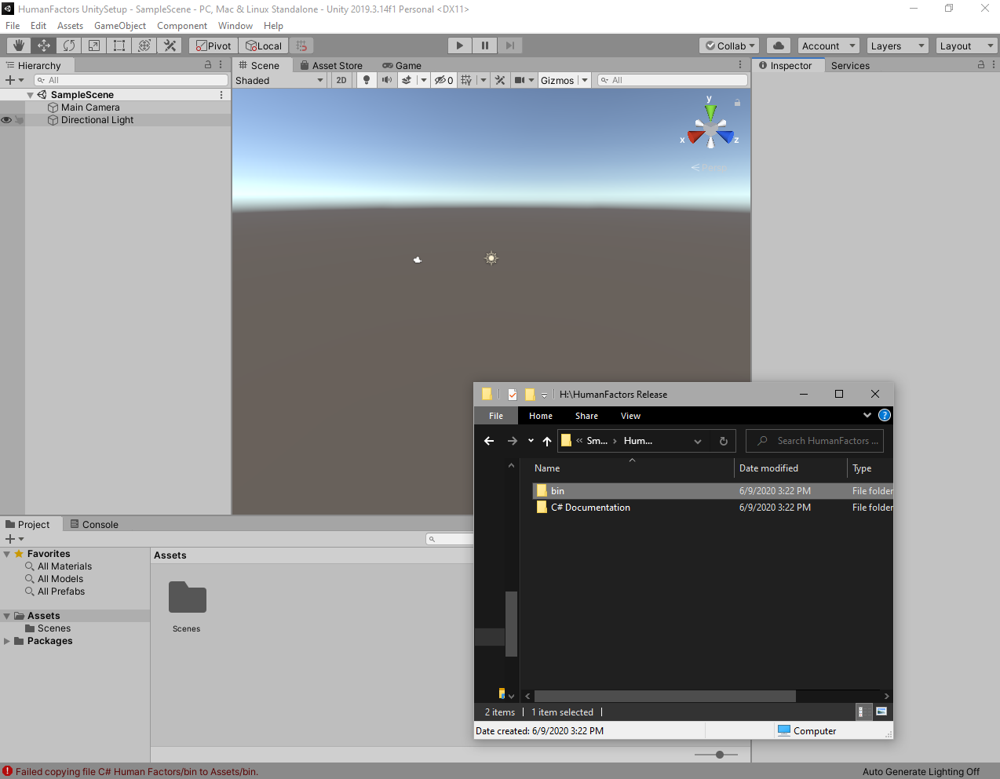
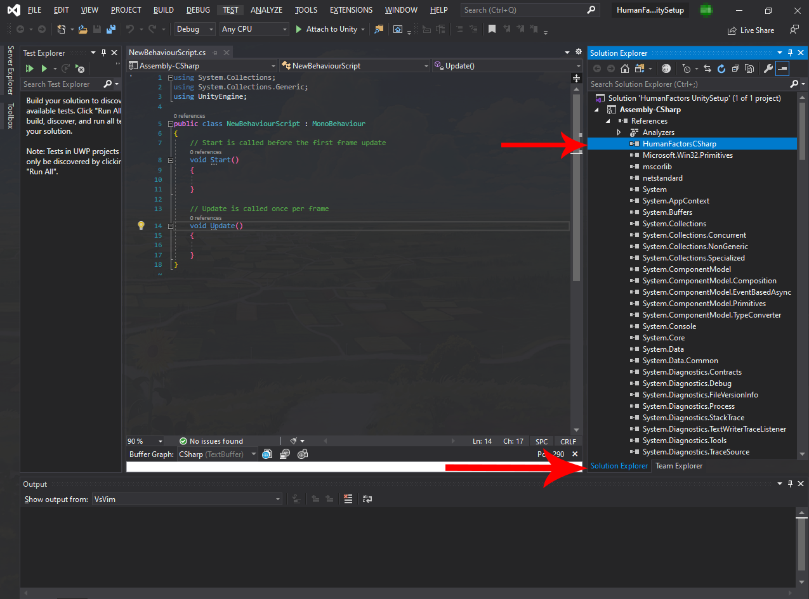
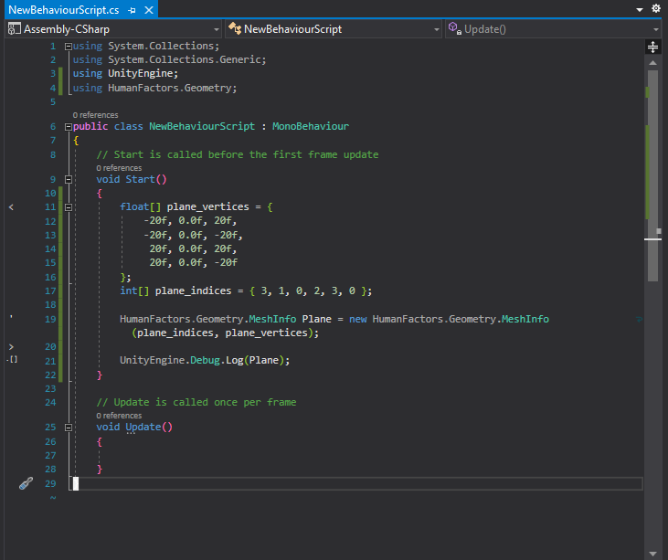
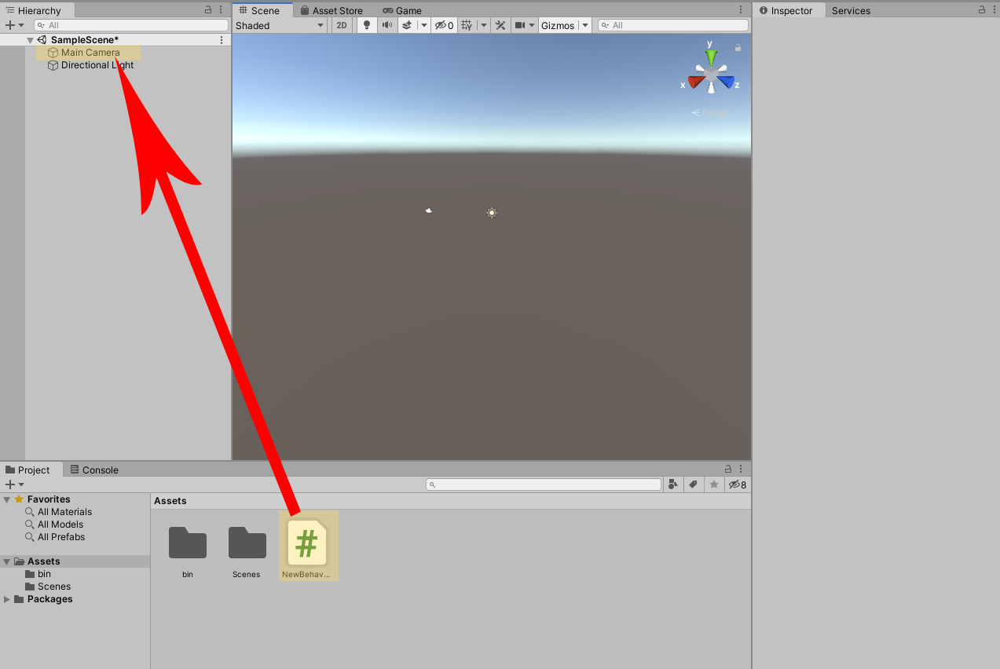
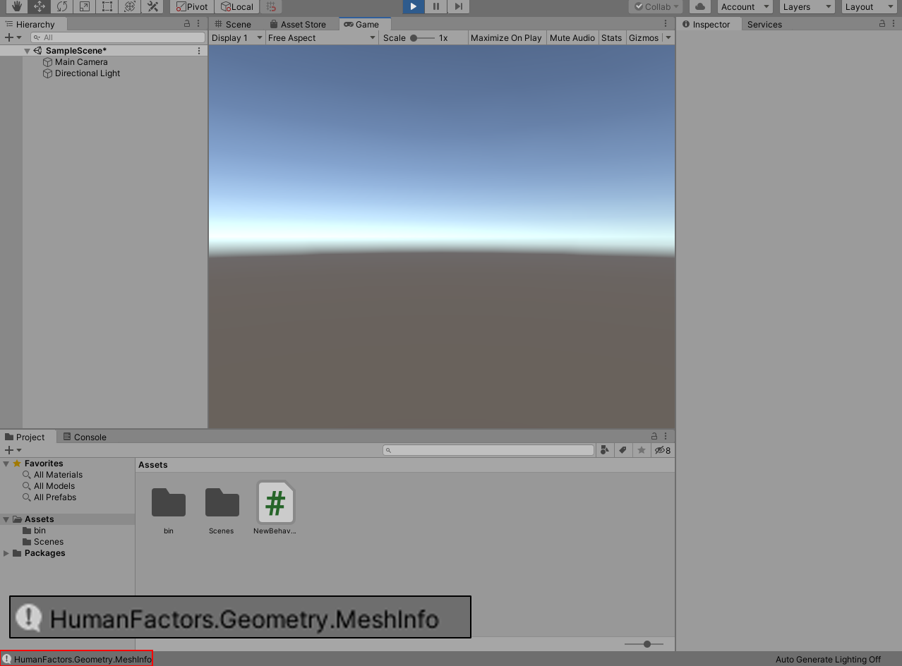

# Walkthrough
## Before we begin

 This guide will demonstrate setting up a new unity project from scratch, then importing the HumanFactors API and verifying that it's working. 

### Prerequisites

- An installation of [Unity](https://unity3d.com/get-unity/download) (Latest version preferred). This example will use the Unity hub, but stand alone versions of unity are also applicable.
- A copy of the HumanFactors release built with support for C#.
  

## Creating a new project

Open up the Unity Hub then click the *NEW* button.
 a new unity project 

 Select your desired project type, directory, and project name. For the sake of this example, we will be using the *3D* project type, and naming our project *HumanFactorsUnitySetup*. When done with this, press the Create button to create the project and wait while unity imports all the necessary info.

 

Upon completion you should be greeted by an empty unity scene.


## Importing The Human Factors Library
Now that the project is set up, we need to place the binaries for HumanFactors in the assets folder so Unity can see and interface with them. Unzip the HumanFactors release package(Don't try to drag from a zipped folder you will get an error), then drag the `bin` folder into the assets window. If you don't see the assets window, then you can click the assets folder on the left side directly under the project tab. 



To verify that the installation is working, we're going to create a small script that constructs a sample plane. Right click on a blank space in the assets window, mouse over *Create*, then select  then select *C# Script*. 


Double click on the newly created script and visual studio should open up (or mono-develop if you don't have visual studio installed). In Visual Studio, navigate to the *Solution Explorer*, and expand the drop downs for your solution, Assembly-C-Sharp, and References. If everything was done correctly, you should see HumanFactors C# under the references for your project.



## Creating A Plane in HumanFactors
Now that we know the library can be referenced by our new script, we will create a plane to ensure that it's working correctly. In the VisualStudio window you've just opened, add the line: 
``` C#
using HumanFactors.Geometry;
```
 to the top of the file, then In the `Start()` function of new behaviour script, add the following code to create a new plane from a list of vertices/indices.

``` C#
        /// Create the array of the plane's vertices and indices
        float[] plane_vertices = {
            -20f, 0.0f, 20f,
            -20f, 0.0f, -20f,
             20f, 0.0f, 20f,
             20f, 0.0f, -20f
        };
        int[] plane_indices = { 3, 1, 0, 2, 3, 0 };

        /// Send them to human factors
        MeshInfo Plane = new MeshInfo(plane_indices, plane_vertices);

        UnityEngine.Debug.Log(Plane);
```

After finished your entire code should look like this.



Now that we have a usable script, we need to attach it to some game object in order to run it. Head back to the unity window, drag *NewBehaviorScript.CS* to *Main Camera* in the scene hierarchy. Since *NewBehaviorScript* is a component of the *Main Camera*, its `Start()` function containing our plane construction code will be run when the editor enters play mode.



Click the play button to enter play mode, then look at your editor's console. If everything went right, then the console located at the bottom of your editor's window should show HumanFactors.Geometry.MeshInfo. 




If you've made it this far, then you're ready to move on to the Graph Generator.
