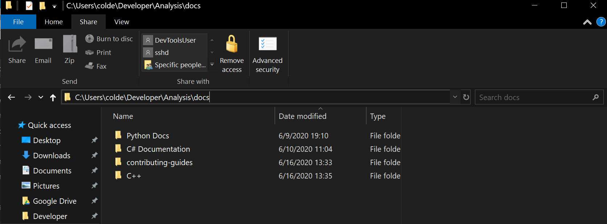
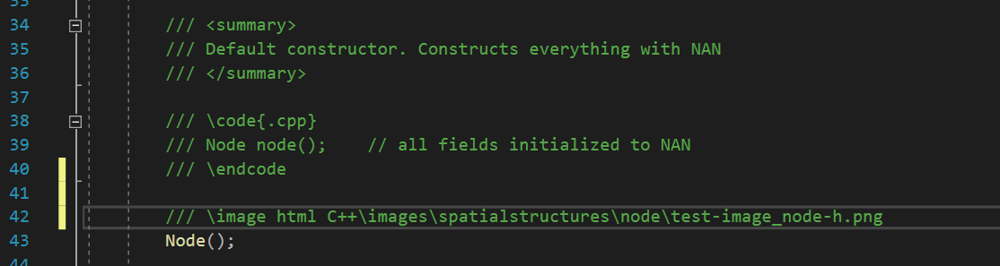
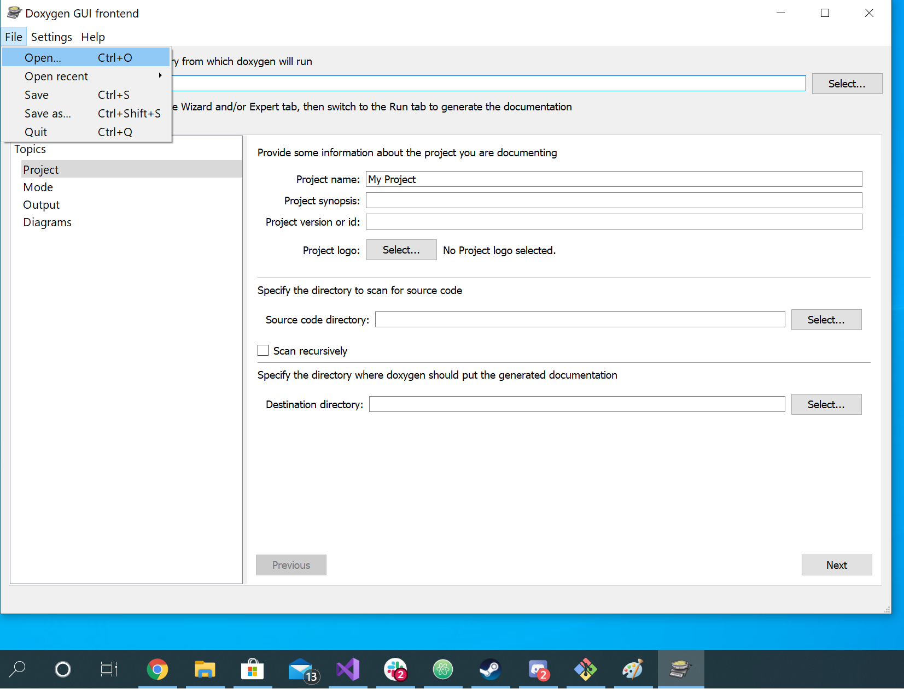
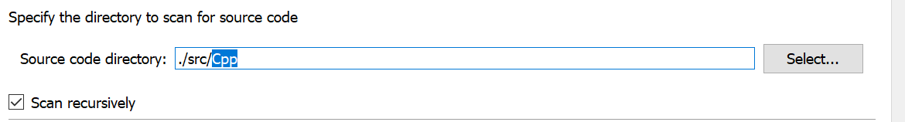

**Building Documentation**

The following steps utilize the Doxygen GUI Frontend.

Load the Doxyfile from this repo into Doxygen, using the File menu.
The Doxyfile is in `dhart\src\Doxyfile`

<b>Step 3:</b><br>
- Navigate to the Expert tab on the left hand side.
- Under topics, click 'Input'.
- On the right side, scroll down until you see EXAMPLE_PATH.
- In the EXAMPLE_PATH section, click the folder button to reveal a file prompt.
- Within the file prompt, select the file path where the snippet resides. (`PATH_TO_FILE\filename.cpp`)
- Add any more directories/paths where your snippets will come from.

Snippets will now appear when you navigate to the Run tab, and click 'Run Doxygen'.

<h3>The `\code` tag should be used for code block examples under 10 lines.</h3>
https://www.doxygen.nl/manual/commands.html#cmdcode

Here is an example for using the `\code` tag:


    /*!
        \code
            // Use the '//' comment style.
            std::cout << "Here is a test statement." << std::endl;
            
            // You may indent your code sample as needed.
            struct my_point {
                double m_x;
                double m_y;
            };
        \endcode
    */


Follow these steps to ensure consistency within the codebase:
0. Start an example block with `/*!`, then hit <b>ENTER</b> to go to the next line.
1. Hit <b>TAB</b> once, then use the `\code` tag. Then, hit <b>ENTER</b>.
2. Hit <b>TAB</b> twice, then begin your code example. You may indent as necessary for your example.
 
3. When your example is finished, hit <b>ENTER</b>, then <b>BACKSPACE</b> so that you are inline with the `\code` tag.
4. Use the `\endcode` tag to end your example.<br>
Then hit <b>ENTER</b>, then hit <b>BACKSPACE</b> as many times as necessary so that you are inline with `/*!`.

5. Finally, end the example block with `*/`.

- Note that any comments that occur within the sample must begin with `//`, followed by a whitespace.

This procedure strikes the best compromise between:
- Making sure that comments work within a code example
- Not having to remove `//` or `///` per line of the example

<br>This ensures ease of viewing<br>
for anyone reading the source code -- <br>
and also assists Doxygen with the<br>
formatting process for the HTML export.

You may now use <b>'Run Doxygen'</b> to export your documentation.<br>
(There are no extra steps, unlike with the snippet section)

<h2>Adding images for headers/sources, and markdown files (`.md`)</h2>

For <b>headers/sources</b>,<br>
we will be using the `\image` tag to add images.<br>
https://www.doxygen.nl/manual/commands.html#cmdimage

For <b>markdown files (`.md`)</b>,<br>
we will be using the markdown syntax for images.<br>
https://www.doxygen.nl/manual/markdown.html#md_images

In <b>dhart</b>,<br>
we have a subdirectory named <b>docs</b>.<br>
(`dhart\docs`)<br>

The Doxyfile will already be configured to have it's `IMAGE_PATH`<br>
configured such that its working directory for images begins at<br>
`dhart\docs`.<br>
When we proceed to later steps, and we are to insert the path of an image file,<br>
assume that the working directory for images begins at<br>
`dhart\docs.`

For example, if a file is saved at:<br>
`dhart\docs\C++\images\spatialstructures\node\test-image_node-h.png`,<br>
you will specify the path:<br>
`C++\images\spatialstructures\node\test-image_node-h.png`.

Notice that the <b>dhart/docs</b> portion is omitted when specifying the image,<br>
since our Doxyfile will already its `IMAGE_PATH` configured to begin at <b>dhart/docs</b>.

<b>Step 0:</b><br>
Begin by saving copy of <b>image_file</b>,<br>
which is the filename of the desired image,<br>
into the following directory:<br>

`dhart\docs\language\img\enclosing_folder\module_name`

`<b>language</b>`,<br>
`<b>enclosing_folder</b>`,<br>
and `<b>module_name</b>` are <b>placeholders</b>.<br>

`images` will be a subdirectory within `<b>language</b>`.

<b>Note:</b><br>
In the <b>dhart/docs</b> directory,<br>
there are <b>three</b> subdirectories:<br>
for which the `<b>language</b>` placeholder applies:
- C# Documentation
- C++
- Python Docs


<b>The contributing-guides subdirectory is for the images in <i>this</i> file.</b>

For `<b>language</b>`,<br>
<b>be sure to choose the appropriate subdirectory</b><br>
when saving your image file.

Although this particular example deals with inserting an image<br>
into documentation for a C++ header file,<br>
the same steps will apply for C# or Python sources.<br>

For instance, the full filepath of `node.h` is<br>
`<b>dhart\src\Cpp\spatialstructures\src\node.h</b>`

`<b>language</b>` is <b>C++</b><br>
`<b>enclosing_folder</b>` is <b>spatialstructures</b><br>
`<b>module_name</b>` is <b>node</b><br>

So, if we wanted to insert an image for any documentation<br>
for `node.h` or `node.cpp`,<br>
the image would be saved into the following directory:<br>

`<b>dhart\docs\C++\images\spatialstructures\node</b>`


If directories `<b>img</b>`, `<b>enclosing_folder</b>`,<br>
or `<b>module_name</b>`<br>
do not already exist, you may create them.<br>

We can now proceed to editing the file where we want to insert the desired image.<br>
This could be a header/source file (step 1a), or a markdown file (step 1b).<br>

Scroll down to the instructions that apply to your use case.<br>

<h3>Adding an image to a header/source file</h3>

<b>Step 1a:</b><br>
In the header/source file where you want the image to appear,<br>
navigate to the line of code where you want the image to appear.<br>

We will now utilize the `\image` tag.

At the line where you want the image to appear,<br>
enter the following:

```
/// \image html language\images\enclosing_folder\module_name\image_file
```

Remember this example is using placeholders;<br>
be sure that <b>language</b>, <b>enclosing_folder</b>, <b>module_name</b>,<br>
and <b>image_file</b> correspond to where your image is saved.<br>

Also note that <b>images</b> is a subdirectory within your chosen <b>language</b> directory.<br>

An example use of the `\image` tag would be:<br>

`/// \image html C++\images\spatialstructures\node\test-image_node-h.png`


<br>
See line 42 - example use of the `\image` tag.

We will now move on to the <b>Doxygen GUI frontend (Doxywizard)</b> application.

<h3>Adding an image to a markdown file (`.md`)</h3>

<b>Step 1b:</b><br>
In the markdown file where you want the image to appear,<br>
navigate to the line at which the image should be inserted.<br>

We will now utilize the markdown syntax for images.<br>

At the line where you want the image to appear,<br>
enter the following:

```

```
Remember this example is using placeholders;<br>
be sure that <b>language</b>, <b>enclosing_folder</b>, <b>module_name</b>,<br>
and <b>image_file</b> correspond to where your image is saved.<br>

An example use of the syntax would be:<br>

```

```
`<b>language</b>` is <b>C++</b><br>
`<b>enclosing_folder</b>` is <b>spatialstructures</b><br>
`<b>module_name</b>` is <b>node</b><br>
`<b>image_file</b>` is <b>test.png</b>


<b>This particular example is of mainpage.md, in dhart/src/Cpp</b>

We will now move on to the <b>Doxygen GUI frontend (Doxywizard)</b> application.

<b>Step 2:</b><br>
Open Doxywizard.<br>


In <b>Doxygen GUI frontend (Doxywizard)</b> -- load the repository's Doxyfile.<br>

Click <b>File > Open...</b><br>



The 'Open configuration file' file explorer will appear.<br>
Navigate to your local copy of the repository,<br>
then click the <b>Doxyfile</b> icon.<br>


<b>Your path to the repository will differ, depending where it resides locally on your machine.</b>

Upon loading the Doxyfile, it will be preconfigured for <b>C++</b>.

Doxygen's <b>working directory</b> will be the location of the <b>Doxyfile</b>,
which is the root directory of the repository.

The <b>Source code directory</b> will be configured for `./src/Cpp`<br>
and the <b>Destination directory</b> will be configured for `./docs/C++`.<br>


<b>This is how the 'Wizard' page for Doxywizard may look for a C++ documentation export.</b>


<b>Change the highlighted portion to Csharp for C# sources, or Python for Python sources.</b>


<b>Change the highlighed portion to C# Documentation for C# exports, or Python for Python exports.</b>

Suggestion:<br>
Before exporting documentation and pushing it to the repository,<br>
change the <b>Destination directory</b> to a test directory of your choice<br>
(relative to your local copy of dhart on your machine)

To do this,<br>
create a directory on your Desktop, named <b>test_docs</b>.<br>
Then, for <b>Destination directory</b>,<br>
you will want to provide a <b>relative path</b> to <b>test_docs</b>,<br>
from Doxywizard's working directory.<br>
(this will differ, depending on where your copy of dhart resides on your machine)


<b>For this example, the destination directory is set to move up two parent directories, so that it can reach Desktop/test_docs.</b>

<b>Step 3:</b><br>
The Doxyfile will be preconfigured to search for images from<br>
`dhart\docs`, via the `IMAGE_PATH` variable.<br>

The current `IMAGE_PATH` value, `./docs` <b>should not be removed</b>,<br>
but you may <b>add to it</b> by doing the following:

Click the <b>Expert</b> tab.<br>


Underneath <b>Topics</b> (on the left hand side of the window),<br>
select <b>Input</b>,<br>


then on the right side,<br>
scroll down until you see the text field for <b>IMAGE_PATH</b>.<br>


Click the folder icon for <b>IMAGE_PATH</b>.<br>


In the file explorer window that appears,<br>
navigate to <b>a directory of your choice.</b>.<br>
Then, click <b>Select Folder</b>.<br>


<b>You can add to the IMAGE_PATH by selecting any directory of your choice.</b><br>
<b>The result will be a filepath relative to Doxygen's working directory.</b>

We have now configured another image path for Doxygen.<br>


<b>When Doxygen inserts images into documentation, it will begin its search in the dhart/docs directory.</b><br>
<b>If you have added another path to IMAGE_PATH (not shown here), it will also search this path.</b>

<b>Step 4:</b><br>


If there is nothing else you would like to configure,<br>
select the <b>Run</b> tab, then click <b>Run doxygen</b>.<br>

Your documentation will now be generated.


Here are some examples for inserting an image into `node.h`,<br>
and `mainpage.md`.


<b>`\image` tag was used within `node.h`.</b>


<b>Markdown syntax for images was used for `mainpage.md`.</b>